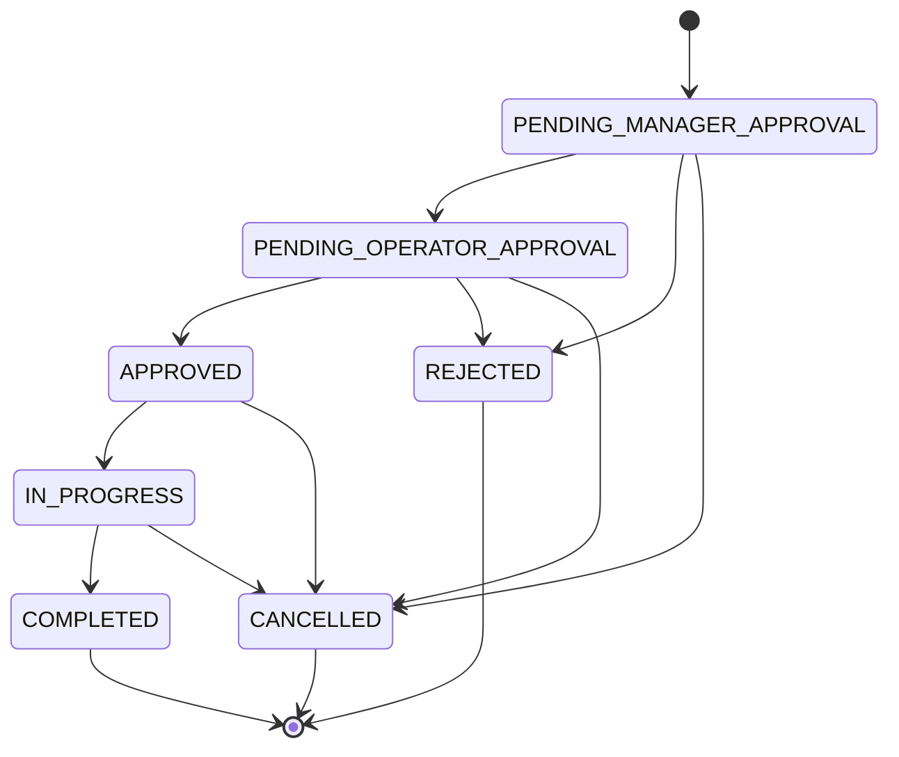
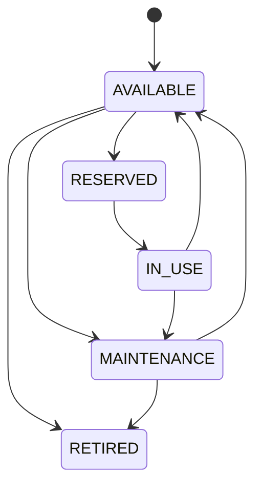
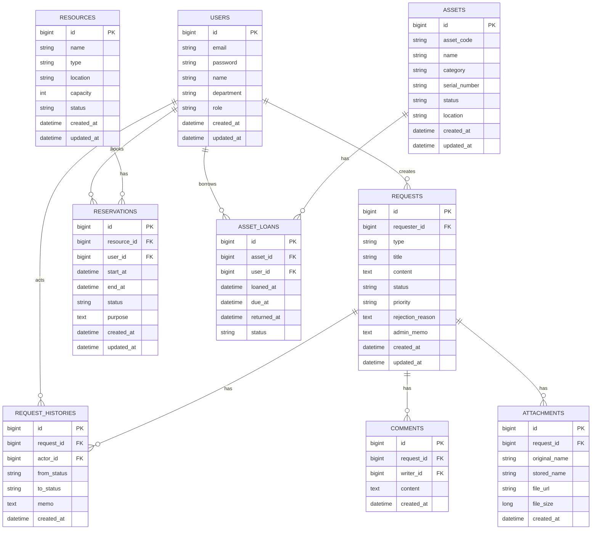

# OfficeOps Hub 상세 기획안

## 1. 프로젝트 개요

`OfficeOps Hub`는 회사 내부에서 발생하는 비품 요청, 회의실 예약, 방문 신청, 자산 대여/반납 업무를 직원과 관리자가 한곳에서 처리할 수 있는 사내 운영 관리 플랫폼이다.

직원은 필요한 요청을 등록하고 진행 상태를 확인할 수 있으며, 관리자는 접수된 요청을 승인, 반려, 처리 중, 완료 상태로 관리한다. 모든 상태 변경은 이력으로 저장되어 요청 처리 과정을 추적할 수 있다.

이 프로젝트는 단순 게시판형 CRUD를 넘어 실제 업무 시스템에서 필요한 권한 관리, 상태 전이, 예약 충돌 방지, 자산 상태 관리, 검색/필터, 대시보드 기능을 포함하는 것을 목표로 한다.

## 2. 프로젝트 목표

### 2.1 사용자 관점

- 직원이 사내 요청을 한곳에서 등록하고 처리 상태를 확인할 수 있다.
- 회의실 예약 시 이미 예약된 시간과 겹치지 않도록 시스템이 검증한다.
- 자산의 사용 가능 여부와 대여 상태를 확인할 수 있다.
- 요청 반려 사유나 관리자 메모를 통해 처리 결과를 명확히 확인할 수 있다.

### 2.2 관리자 관점

- 전체 요청을 유형, 상태, 우선순위, 날짜별로 조회하고 관리할 수 있다.
- 요청을 승인, 반려, 처리 중, 완료 상태로 변경할 수 있다.
- 자산을 등록하고 사용 가능, 사용 중, 점검 중, 폐기 상태로 관리할 수 있다.
- 대시보드에서 요청 처리 현황, 예약 현황, 자산 상태를 확인할 수 있다.

### 2.3 포트폴리오 관점

- Spring Boot 기반 REST API 설계 역량을 보여준다.
- Spring Security와 JWT를 활용한 인증/인가 구조를 구현한다.
- 요청 상태 전이와 예약 중복 방지 같은 비즈니스 로직을 구현한다.
- React 기반 사용자/관리자 화면을 분리해 구성한다.
- PostgreSQL 기반 관계형 데이터 모델링을 보여준다.
- Docker Compose, AWS EC2, AWS RDS, GitHub Actions를 활용해 배포 경험을 확보한다.

## 3. 핵심 컨셉

```text
직원이 요청한다
-> 관리자가 확인한다
-> 승인, 반려, 처리 중, 완료 상태로 변경한다
-> 자산 또는 예약 상태가 함께 변경된다
-> 모든 처리 과정이 이력으로 남는다
-> 관리자는 대시보드에서 운영 현황을 확인한다
```

MVP 핵심 문장은 다음과 같다.

```text
비품 요청 + 회의실 예약 + 팀장 1차 승인 + 운영 담당자 최종 승인 + 자산 상태 관리 + 처리 이력 + 대시보드
```

## 4. 주요 사용자

| 역할 | 설명 | 주요 기능 |
| --- | --- | --- |
| 일반 직원 | 사내 요청과 예약을 등록하는 사용자 | 요청 등록, 내 요청 조회, 예약 신청, 요청 취소, 자산 조회 |
| 관리자 | 요청, 자산, 예약을 관리하는 운영 담당자 | 전체 요청 조회, 승인/반려, 자산 관리, 예약 관리, 통계 확인 |

초기 버전에서는 `ROLE_USER`, `ROLE_ADMIN` 두 권한만 사용한다.

추후 확장 시 부서 관리자, 총관리자, 요청 담당자 권한을 추가할 수 있다.

## 5. 주요 기능 범위

### 5.1 필수 기능

| 영역 | 기능 | 설명 |
| --- | --- | --- |
| 인증 | 회원가입 | 이름, 이메일, 비밀번호, 부서 정보 입력 |
| 인증 | 로그인 | JWT 기반 로그인 |
| 인증 | 로그아웃 | 클라이언트 토큰 제거, Refresh Token 사용 시 서버 측 무효화 |
| 인증 | 내 정보 조회 | 로그인한 사용자 정보 조회 |
| 권한 | 사용자/관리자 권한 분리 | 관리자 API는 관리자만 접근 가능 |
| 요청 | 요청 등록 | 비품 요청, 방문 신청, 시설 요청 등 등록 |
| 요청 | 요청 목록 조회 | 내 요청 또는 전체 요청 조회 |
| 요청 | 요청 상세 조회 | 요청 내용, 상태, 이력, 관리자 메모 확인 |
| 요청 | 요청 수정 | 접수 상태의 본인 요청만 수정 가능 |
| 요청 | 요청 취소 | 완료 전 요청 취소 가능 |
| 관리자 | 승인/반려 | 요청을 승인 또는 반려 처리 |
| 관리자 | 처리 상태 변경 | 승인된 요청을 처리 중, 완료로 변경 |
| 관리자 | 반려 사유/메모 | 반려 또는 처리 과정에서 관리자 메모 저장 |
| 이력 | 상태 변경 이력 | 모든 요청 상태 변경을 이력으로 저장 |
| 예약 | 회의실 예약 | 날짜, 시작 시간, 종료 시간, 목적 입력 |
| 예약 | 중복 예약 방지 | 같은 자원에 겹치는 시간 예약 차단 |
| 예약 | 예약 취소 | 본인 예약 취소, 관리자의 전체 예약 관리 |
| 자산 | 자산 목록 조회 | 자산명, 카테고리, 상태, 위치 조회 |
| 자산 | 자산 등록/수정 | 관리자가 자산 정보 관리 |
| 자산 | 자산 상태 변경 | 사용 가능, 예약됨, 사용 중, 점검 중, 폐기 |
| 자산 | 대여/반납 이력 | 자산 사용 이력 추적 |
| 검색 | 검색/필터 | 상태, 유형, 날짜, 요청자, 우선순위 기준 |
| 검색 | 페이지네이션/정렬 | 목록 성능과 사용성 확보 |
| 대시보드 | 관리자 통계 | 요청 건수, 처리율, 자산 상태, 예약 현황 |
| 문서 | Swagger/OpenAPI | API 명세 자동화 |
| 검증 | Validation | 입력값, 시간, 상태값 검증 |
| 예외 | 공통 예외 응답 | API 에러 응답 형식 통일 |

### 5.2 확장 기능

| 기능 | 설명 | 우선순위 |
| --- | --- | --- |
| 파일 첨부 | 요청에 이미지, 문서 첨부 | 중 |
| 알림 | 승인/반려/완료 시 알림 생성 | 중 |
| 댓글 | 요청별 사용자/관리자 커뮤니케이션 | 중 |
| CSV 다운로드 | 관리자 목록 데이터 다운로드 | 하 |
| 이메일 알림 | 처리 결과 이메일 발송 | 하 |
| AWS S3 파일 업로드 | 첨부파일 운영 환경 저장 | 하 |
| AI 요청 요약 | 긴 요청 내용을 요약하거나 처리 메모 초안 생성 | 하 |

## 6. 메뉴 및 화면 구조

### 6.1 공통 화면

| 화면 | 설명 |
| --- | --- |
| 로그인 | 이메일, 비밀번호 로그인 |
| 회원가입 | 사용자 계정 생성 |
| 권한 없음 | 접근 권한이 없는 페이지 안내 |
| 공통 레이아웃 | 사이드바, 상단바, 사용자 메뉴 |

### 6.2 사용자 화면

| 화면 | 설명 |
| --- | --- |
| 사용자 홈 | 내 요청 현황, 내 예약 현황 요약 |
| 내 요청 목록 | 내가 등록한 요청 목록 조회 |
| 요청 등록 | 요청 유형별 등록 폼 |
| 요청 상세 | 요청 내용, 상태, 이력, 관리자 메모 확인 |
| 회의실 예약 | 자원 선택, 날짜/시간 선택, 예약 신청 |
| 내 예약 목록 | 내가 예약한 회의실 목록 |
| 자산 목록 | 사용 가능한 자산 조회 |
| 내 정보 | 이름, 부서 등 기본 정보 확인 |

### 6.3 관리자 화면

| 화면 | 설명 |
| --- | --- |
| 관리자 대시보드 | 요청, 예약, 자산 현황 통계 |
| 전체 요청 관리 | 전체 요청 조회, 필터, 상태 변경 |
| 요청 상세 관리 | 승인, 반려, 처리 중, 완료, 관리자 메모 |
| 자산 관리 | 자산 등록, 수정, 상태 변경 |
| 예약 관리 | 전체 예약 조회, 취소 처리 |
| 사용자 관리 | 사용자 목록 조회, 권한 확인 |

## 7. 라우팅 구조

```text
/login
/signup

/user
/user/requests
/user/requests/new
/user/requests/:id
/user/reservations
/user/reservations/new
/user/assets
/user/me

/admin
/admin/dashboard
/admin/requests
/admin/requests/:id
/admin/assets
/admin/reservations
/admin/users
```

## 8. 요청 유형

| 요청 유형 | 설명 | 예시 |
| --- | --- | --- |
| ASSET_REQUEST | 비품/장비 요청 | 노트북, 모니터, 키보드 대여 |
| PURCHASE_REQUEST | 구매 요청 | 사무용품, 소프트웨어 구매 |
| VISITOR_REQUEST | 방문 신청 | 외부 방문자 등록 |
| FACILITY_REQUEST | 시설 요청 | 회의실 장비 고장, 좌석 변경 |
| SUPPORT_REQUEST | 업무 지원 요청 | 계정 생성, 권한 요청 |

MVP에서는 `ASSET_REQUEST`, `VISITOR_REQUEST`, `FACILITY_REQUEST`를 우선 구현한다.

## 9. 요청 상태 설계



| 상태 | 설명 | 변경 가능 주체 |
| --- | --- | --- |
| PENDING_MANAGER_APPROVAL | 팀장 승인 대기 | 사용자 |
| PENDING_OPERATOR_APPROVAL | 운영 담당자 최종 승인 대기 | 팀장 |
| APPROVED | 최종 승인됨 | 운영 담당자/관리자 |
| REJECTED | 반려됨 | 팀장/운영 담당자/관리자 |
| IN_PROGRESS | 처리 중 | 운영 담당자/요청 담당자/관리자 |
| COMPLETED | 완료 | 운영 담당자/요청 담당자/관리자 |
| CANCELLED | 취소됨 | 사용자/관리자 |

### 9.1 상태 전이 규칙

- 사용자는 요청을 등록할 수 있다.
- 사용자는 본인이 등록한 요청만 조회, 수정, 취소할 수 있다.
- 사용자는 `PENDING_MANAGER_APPROVAL` 상태의 요청만 수정할 수 있다.
- 사용자는 승인, 반려, 처리 중, 완료 상태로 직접 변경할 수 없다.
- 팀장은 소속 팀원의 요청을 1차 승인하거나 반려할 수 있다.
- 운영 담당자는 팀장 승인 완료 요청을 최종 승인하거나 반려할 수 있다.
- 운영 담당자 또는 관리자는 최종 승인 시 담당자, 처리 예정일, 마감일을 지정할 수 있다.
- 운영 담당자, 요청 담당자, 관리자는 `APPROVED` 상태의 요청을 처리 중으로 변경할 수 있다.
- 운영 담당자, 요청 담당자, 관리자는 `IN_PROGRESS` 상태의 요청을 완료할 수 있다.
- `COMPLETED`, `REJECTED`, `CANCELLED` 상태는 최종 상태다.
- 모든 상태 변경은 `request_histories`에 저장한다.
- 모든 승인/반려 단계는 `request_approvals`에 저장한다.

## 10. 자산 상태 설계



| 상태 | 설명 |
| --- | --- |
| AVAILABLE | 사용 가능 |
| RESERVED | 예약됨 |
| IN_USE | 사용 중 |
| MAINTENANCE | 점검/수리 중 |
| RETIRED | 폐기 |

### 10.1 자산 관리 규칙

- 자산 등록과 수정은 관리자만 가능하다.
- 자산 코드는 중복될 수 없다.
- 시리얼 번호는 선택값으로 두되, 입력 시 중복을 막는다.
- 대여 시 자산 상태는 `IN_USE`로 변경한다.
- 반납 시 자산 상태는 `AVAILABLE`로 변경한다.
- 점검 중인 자산은 대여 또는 예약할 수 없다.
- 폐기된 자산은 목록에서는 조회 가능하지만 신규 대여나 예약은 불가능하다.
- 대여와 반납은 `asset_loans`에 이력으로 저장한다.

## 11. 예약 설계

예약 대상은 회의실, 좌석, 공용 장비로 확장할 수 있다.

MVP에서는 회의실 예약을 우선 구현한다.

| 항목 | 설명 |
| --- | --- |
| 예약 대상 | 회의실 |
| 예약 단위 | 30분 단위 |
| 예약 가능 시간 | 평일 09:00 ~ 18:00 |
| 최소 예약 시간 | 30분 |
| 최대 예약 시간 | 4시간 |
| 예약 취소 | 시작 시간 전까지만 가능 |

### 11.1 예약 충돌 조건

같은 자원에 대해 아래 조건을 만족하면 시간이 겹치는 예약으로 판단한다.

```text
새 예약 시작 시간 < 기존 예약 종료 시간
AND
새 예약 종료 시간 > 기존 예약 시작 시간
```

예시:

```text
기존 예약: 회의실 A, 2026-06-10 10:00 ~ 11:00

불가능:
회의실 A, 2026-06-10 10:30 ~ 11:30

가능:
회의실 A, 2026-06-10 11:00 ~ 12:00
```

### 11.2 예약 상태

| 상태 | 설명 |
| --- | --- |
| RESERVED | 예약 완료 |
| CANCELLED | 예약 취소 |
| COMPLETED | 사용 완료 |

## 12. 데이터베이스 설계

### 12.1 주요 테이블

| 테이블 | 역할 |
| --- | --- |
| users | 사용자 정보 |
| requests | 요청 본문 |
| request_histories | 요청 상태 변경 이력 |
| assets | 자산 정보 |
| asset_loans | 자산 대여/반납 이력 |
| resources | 예약 대상 |
| reservations | 예약 정보 |
| notifications | 알림, 확장 기능 |
| attachments | 첨부파일, 확장 기능 |
| comments | 요청 댓글/관리자 메모, 확장 기능 |

### 12.2 ERD



## 13. API 설계

### 13.1 인증 API

```text
POST   /api/auth/signup
POST   /api/auth/login
POST   /api/auth/logout
POST   /api/auth/reissue
GET    /api/users/me
PATCH  /api/users/me
```

### 13.2 요청 API

```text
GET    /api/requests
POST   /api/requests
GET    /api/requests/{id}
PATCH  /api/requests/{id}
DELETE /api/requests/{id}
PATCH  /api/requests/{id}/status
GET    /api/requests/{id}/histories
```

### 13.3 관리자 요청 API

```text
GET    /api/admin/requests
GET    /api/admin/requests/{id}
PATCH  /api/admin/requests/{id}/approve
PATCH  /api/admin/requests/{id}/reject
PATCH  /api/admin/requests/{id}/in-progress
PATCH  /api/admin/requests/{id}/complete
PATCH  /api/admin/requests/{id}/memo
```

### 13.4 자산 API

```text
GET    /api/assets
GET    /api/assets/{id}
POST   /api/admin/assets
PATCH  /api/admin/assets/{id}
PATCH  /api/admin/assets/{id}/status
POST   /api/admin/assets/{id}/loans
PATCH  /api/admin/asset-loans/{id}/return
GET    /api/admin/asset-loans
```

### 13.5 예약 API

```text
GET    /api/resources
POST   /api/admin/resources
PATCH  /api/admin/resources/{id}

GET    /api/reservations
POST   /api/reservations
PATCH  /api/reservations/{id}/cancel

GET    /api/admin/reservations
PATCH  /api/admin/reservations/{id}/cancel
```

### 13.6 대시보드 API

```text
GET    /api/admin/dashboard/summary
GET    /api/admin/dashboard/requests/monthly
GET    /api/admin/dashboard/requests/status
GET    /api/admin/dashboard/assets/status
GET    /api/admin/dashboard/reservations/daily
```

## 14. 권한 설계

| 기능 | 일반 직원 | 관리자 |
| --- | --- | --- |
| 회원가입/로그인 | 가능 | 가능 |
| 내 정보 조회 | 가능 | 가능 |
| 내 요청 등록 | 가능 | 가능 |
| 내 요청 조회 | 가능 | 가능 |
| 요청 수정/취소 | 본인 요청만 가능 | 가능 |
| 전체 요청 조회 | 불가 | 가능 |
| 승인/반려 | 불가 | 가능 |
| 처리 중/완료 변경 | 불가 | 가능 |
| 자산 조회 | 가능 | 가능 |
| 자산 등록/수정 | 불가 | 가능 |
| 자산 대여/반납 처리 | 불가 | 가능 |
| 예약 등록 | 가능 | 가능 |
| 내 예약 취소 | 가능 | 가능 |
| 전체 예약 관리 | 불가 | 가능 |
| 대시보드 통계 | 제한 | 가능 |
| 사용자 목록 조회 | 불가 | 가능 |

백엔드에서 반드시 권한을 검증한다. 프론트엔드 라우팅 제한은 사용자 경험을 위한 보조 수단으로만 사용한다.

## 15. 기술 스택

### 15.1 Backend

| 기술 | 사용 목적 |
| --- | --- |
| Java 21 | 백엔드 메인 언어 |
| Spring Boot 3 | REST API 서버 |
| Spring Security | 인증/인가 처리 |
| JWT | Access Token 기반 인증 |
| Spring Data JPA | ORM, 데이터 접근 |
| PostgreSQL | 운영 DB |
| Flyway | DB 마이그레이션 관리 |
| Bean Validation | 요청 DTO 검증 |
| Swagger/OpenAPI | API 문서화 |
| JUnit 5 | 테스트 |
| Mockito | 단위 테스트 Mock 처리 |

### 15.2 Frontend

| 기술 | 사용 목적 |
| --- | --- |
| React | 프론트엔드 UI 구현 |
| Vite | 빠른 개발 서버와 빌드 |
| React Router | 페이지 라우팅 |
| Axios | API 요청 |
| Tailwind CSS | UI 스타일링 |
| Zustand | 로그인 사용자, 토큰, UI 상태 관리 |
| TanStack Query | 서버 데이터 캐싱, 목록 조회, 동기화 |
| React Hook Form | 입력 폼 관리 |
| Zod | 프론트 입력값 검증 |
| Chart.js 또는 ApexCharts | 대시보드 차트 |

`Pinia`는 Vue 전용 상태 관리 라이브러리이므로 React 프로젝트에서는 사용하지 않는다.

### 15.3 Infra

| 기술 | 사용 목적 |
| --- | --- |
| Docker Compose | 로컬 개발 환경 구성 |
| AWS EC2 | 백엔드/프론트 서버 배포 |
| AWS RDS PostgreSQL | 운영 DB |
| GitHub Actions | 테스트/빌드 자동화 |
| Nginx | 프론트 정적 파일 서빙, Reverse Proxy |
| AWS S3 | 파일 첨부 확장 시 저장소 |

## 16. 백엔드 패키지 구조

```text
com.officeops
 ├─ auth
 │   ├─ controller
 │   ├─ service
 │   ├─ dto
 │   ├─ security
 │   └─ jwt
 ├─ user
 │   ├─ controller
 │   ├─ service
 │   ├─ repository
 │   ├─ entity
 │   └─ dto
 ├─ request
 │   ├─ controller
 │   ├─ service
 │   ├─ repository
 │   ├─ entity
 │   ├─ dto
 │   └─ type
 ├─ asset
 ├─ reservation
 ├─ dashboard
 ├─ notification
 └─ common
     ├─ config
     ├─ exception
     ├─ response
     └─ util
```

## 17. 프론트엔드 디렉터리 구조

```text
src
 ├─ api
 │   ├─ axiosInstance.js
 │   ├─ authApi.js
 │   ├─ requestApi.js
 │   ├─ assetApi.js
 │   └─ reservationApi.js
 ├─ app
 │   └─ router.jsx
 ├─ components
 │   ├─ common
 │   ├─ layout
 │   ├─ forms
 │   ├─ tables
 │   └─ charts
 ├─ features
 │   ├─ auth
 │   ├─ requests
 │   ├─ assets
 │   ├─ reservations
 │   └─ dashboard
 ├─ hooks
 ├─ pages
 │   ├─ auth
 │   ├─ user
 │   └─ admin
 ├─ stores
 │   └─ authStore.js
 ├─ styles
 └─ utils
```

## 18. 인증/보안 설계

### 18.1 토큰 전략

MVP에서는 Access Token 기반 JWT 인증을 구현한다.

운영 완성도를 높이려면 Refresh Token을 함께 사용한다.

| 토큰 | 역할 | 저장 위치 |
| --- | --- | --- |
| Access Token | API 인증 | 메모리 또는 Zustand |
| Refresh Token | Access Token 재발급 | HttpOnly Cookie 권장 |

### 18.2 보안 규칙

- 비밀번호는 BCrypt로 암호화한다.
- 관리자 API는 `ROLE_ADMIN`만 접근 가능하다.
- 사용자 API는 로그인 사용자만 접근 가능하다.
- 본인 리소스 접근 여부를 서비스 계층에서 검증한다.
- CORS 허용 도메인을 환경별로 분리한다.
- 운영 환경의 JWT Secret은 환경변수로 관리한다.

## 19. 공통 응답 및 예외 설계

### 19.1 성공 응답 예시

```json
{
  "success": true,
  "data": {
    "id": 1,
    "title": "노트북 대여 요청"
  }
}
```

### 19.2 에러 응답 예시

```json
{
  "success": false,
  "error": {
    "code": "REQUEST_INVALID_STATUS",
    "message": "현재 상태에서는 요청을 완료 처리할 수 없습니다."
  }
}
```

### 19.3 주요 예외 코드

| 코드 | 설명 |
| --- | --- |
| AUTH_INVALID_TOKEN | 유효하지 않은 토큰 |
| AUTH_ACCESS_DENIED | 접근 권한 없음 |
| USER_NOT_FOUND | 사용자를 찾을 수 없음 |
| REQUEST_NOT_FOUND | 요청을 찾을 수 없음 |
| REQUEST_INVALID_STATUS | 잘못된 요청 상태 변경 |
| RESERVATION_CONFLICT | 예약 시간이 중복됨 |
| ASSET_NOT_AVAILABLE | 자산을 사용할 수 없음 |
| VALIDATION_ERROR | 입력값 검증 실패 |

## 20. 검색/필터 조건

### 20.1 요청 목록

| 조건 | 설명 |
| --- | --- |
| status | 요청 상태 |
| type | 요청 유형 |
| priority | 우선순위 |
| requesterName | 요청자 이름 |
| department | 부서 |
| startDate | 생성일 시작 |
| endDate | 생성일 종료 |
| page | 페이지 번호 |
| size | 페이지 크기 |
| sort | 정렬 조건 |

### 20.2 예약 목록

| 조건 | 설명 |
| --- | --- |
| resourceId | 예약 대상 |
| userId | 예약자 |
| date | 예약 날짜 |
| status | 예약 상태 |
| page | 페이지 번호 |
| size | 페이지 크기 |

### 20.3 자산 목록

| 조건 | 설명 |
| --- | --- |
| keyword | 자산명 또는 자산 코드 |
| category | 카테고리 |
| status | 자산 상태 |
| location | 위치 |
| page | 페이지 번호 |
| size | 페이지 크기 |

## 21. 테스트 전략

### 21.1 필수 테스트

| 테스트 대상 | 검증 내용 |
| --- | --- |
| 인증 | 로그인 성공/실패, 비밀번호 암호화 |
| 권한 | 일반 사용자의 관리자 API 접근 차단 |
| 요청 상태 전이 | 허용된 상태 변경과 금지된 상태 변경 |
| 요청 접근 제어 | 다른 사용자의 요청 조회/수정 차단 |
| 예약 중복 방지 | 겹치는 예약 차단, 맞닿는 예약 허용 |
| 자산 대여/반납 | 상태 변경과 이력 저장 |
| Validation | 필수값 누락, 잘못된 시간 입력 차단 |

### 21.2 우선 구현할 테스트 케이스

```text
1. PENDING_MANAGER_APPROVAL 요청은 팀장이 PENDING_OPERATOR_APPROVAL로 변경할 수 있다.
2. PENDING_OPERATOR_APPROVAL 요청은 운영 담당자가 APPROVED로 변경할 수 있다.
3. 최종 승인 시 담당자와 마감일을 지정할 수 있다.
4. COMPLETED 요청은 다시 수정할 수 없다.
5. 일반 사용자는 다른 사용자의 요청을 조회할 수 없다.
6. 10:00~11:00 예약이 있을 때 10:30~11:30 예약은 실패한다.
7. 10:00~11:00 예약이 있을 때 11:00~12:00 예약은 성공한다.
8. 점검 중인 자산은 대여할 수 없다.
9. 자산 반납 시 상태가 AVAILABLE로 변경된다.
```

## 22. MVP 개발 일정

### 22.1 4주 MVP

| 주차 | 목표 | 주요 산출물 |
| --- | --- | --- |
| 1주차 | 기획 확정, ERD, API 명세, 프로젝트 세팅 | ERD, API 문서 초안, 백엔드/프론트 초기 구조 |
| 2주차 | 인증/권한, 요청 CRUD, 기본 화면 | 로그인, 회원가입, 내 요청 목록, 요청 등록 |
| 3주차 | 관리자 요청 처리, 이력, 예약, 자산 | 승인/반려, 상태 이력, 예약 중복 방지, 자산 관리 |
| 4주차 | 대시보드, 검색/필터, 테스트, 문서화 | 대시보드, Swagger, README, 테스트 코드 |

### 22.2 6~8주 확장

| 기간 | 목표 |
| --- | --- |
| 5주차 | 파일 첨부, 댓글/관리자 메모 고도화, 알림 |
| 6주차 | CSV 다운로드, 테스트 보강, 예외 처리 개선 |
| 7주차 | Docker Compose, EC2/RDS 배포 |
| 8주차 | GitHub Actions, 발표 자료, 트러블슈팅 문서 |

## 23. 팀원 2명 역할 분담

| 역할 | 담당 업무 |
| --- | --- |
| 팀원 A | 백엔드 중심: 인증/권한, 요청 API, 상태 전이, DB 설계, 이력 저장, 테스트 |
| 팀원 B | 프론트엔드 중심: React 화면, 라우팅, 요청/예약/자산 화면, 관리자 대시보드 |
| 공통 | ERD, API 명세, GitHub Issues, README, 배포, 발표 자료 |

역할은 중심 업무 기준으로 나누되, API 명세와 핵심 비즈니스 규칙은 함께 설계한다.

## 24. GitHub Issues 예시

```text
[BE] 회원가입 API 구현
[BE] 로그인 및 JWT 발급 구현
[BE] 요청 등록 API 구현
[BE] 요청 상태 변경 이력 저장 구현
[BE] 예약 중복 방지 로직 구현
[BE] 자산 대여/반납 API 구현
[FE] 로그인 화면 구현
[FE] 내 요청 목록 화면 구현
[FE] 요청 등록 폼 구현
[FE] 관리자 요청함 화면 구현
[FE] 회의실 예약 화면 구현
[INFRA] Docker Compose 환경 구성
[DOCS] README 작성
```

## 25. README 어필 포인트

README에서는 아래 내용을 강조한다.

- 단순 게시판이 아니라 사내 운영 업무 흐름을 모델링했다.
- 사용자와 관리자 권한을 분리했다.
- 요청 상태 전이 규칙을 설계하고 잘못된 상태 변경을 차단했다.
- 회의실 예약 시간 충돌 방지 로직을 구현했다.
- 자산 대여/반납 상태와 이력을 추적했다.
- 검색, 필터, 페이지네이션, 대시보드를 구현했다.
- Docker와 AWS를 활용해 실제 배포 환경을 구성했다.

## 26. 면접 설명 예시

```text
OfficeOps Hub는 사내 비품 요청, 회의실 예약, 자산 관리를 통합한 운영 관리 시스템입니다.
단순 CRUD를 넘어 사용자/관리자 권한 분리, 요청 상태 전이, 예약 중복 방지,
자산 상태 관리, 처리 이력 저장을 구현했습니다.

백엔드는 Java 21과 Spring Boot 3를 사용했고, Spring Security와 JWT로 인증/인가를 처리했습니다.
요청 상태 변경은 허용된 전이만 가능하도록 서비스 계층에서 검증했으며,
모든 상태 변경은 이력 테이블에 저장했습니다.

프론트엔드는 React와 Vite를 사용했고, React Router로 사용자/관리자 화면을 분리했습니다.
TanStack Query로 서버 상태를 관리하고, Zustand로 로그인 사용자와 UI 상태를 관리했습니다.
```

## 27. 최종 추천 범위

1차 목표는 아래 범위로 고정한다.

```text
OfficeOps Hub MVP

핵심 기능:
- 회원가입/로그인
- 일반 직원/팀장/운영 담당자/관리자 권한 분리
- 비품 요청 및 방문 신청 등록
- 팀장 1차 승인/반려
- 운영 담당자 최종 승인/반려
- 담당자 지정 및 처리 중/완료
- 반려 사유 및 관리자 메모
- 요청 상태 변경 이력
- 회의실 예약 및 중복 예약 방지
- 자산 목록 및 상태 관리
- 자산 대여/반납 이력
- 검색/필터/페이지네이션
- 관리자 대시보드
- Swagger API 문서
- Docker Compose 개발 환경

기술 스택:
- Backend: Java 21 + Spring Boot 3 + Spring Security + JWT + JPA + PostgreSQL
- Frontend: React + Vite + React Router + Axios + Tailwind CSS + Zustand + TanStack Query
- Infra: Docker Compose + AWS EC2 + AWS RDS + GitHub Actions
```

처음부터 모든 확장 기능을 넣기보다 MVP의 요청 상태 전이, 예약 충돌 방지, 자산 대여/반납 이력, 권한 검증을 안정적으로 구현하는 것이 중요하다.

## 28. 추가 확정 범위

개발 문서 작성 과정에서 아래 기능과 화면을 추가 확정한다.

### 28.1 MVP 필수 추가

| 항목 | 설명 |
| --- | --- |
| 404 Not Found 화면 | 존재하지 않는 URL 접근 시 안내 화면을 표시한다. |
| 요청 수정 방식 명확화 | 별도 수정 페이지 없이 요청 상세 화면 안에서 수정 모드로 전환한다. |
| 관리자 회의실/자원 관리 | 관리자가 회의실/자원을 등록, 수정, 사용 중지 처리할 수 있다. |
| 요청 유형별 추가 입력값 | 요청 유형에 따라 필요한 추가 필드를 입력받는다. |

요청 유형별 추가 입력값은 다음과 같다.

| 요청 유형 | 추가 입력값 |
| --- | --- |
| ASSET_REQUEST | 희망 자산 카테고리, 사용 시작일, 반납 예정일 |
| VISITOR_REQUEST | 방문자 이름, 방문자 연락처, 방문 일시, 방문 목적 |
| FACILITY_REQUEST | 위치, 문제 유형, 희망 처리일 |

### 28.2 권장 추가

| 항목 | 설명 |
| --- | --- |
| 내 자산 대여 현황 화면 | 사용자가 본인이 대여 중이거나 과거 대여한 자산을 확인한다. |
| 관리자 사용자 상세/권한 변경 | 관리자가 사용자 상세 정보를 확인하고 권한을 변경한다. |
| 예약 캘린더 화면 | 사용자와 관리자가 날짜별/회의실별 예약 현황을 캘린더로 확인한다. |

### 28.3 MVP 이후 추가

| 항목 | 설명 |
| --- | --- |
| 비밀번호 변경 | 로그인 사용자가 본인 비밀번호를 변경한다. |
| Refresh Token 재발급 | Access Token 만료 시 Refresh Token으로 토큰을 재발급한다. |
| 알림 목록 | 요청 승인, 반려, 완료, 예약 취소 등 알림을 조회한다. |
| 파일 첨부 | 요청에 이미지나 문서 파일을 첨부한다. |

### 28.4 추가 라우팅

```text
공통:
/forbidden
*

사용자:
/user/reservations/calendar
/user/asset-loans
/user/me/password
/user/notifications

관리자:
/admin/reservations/calendar
/admin/resources
/admin/users/:id
```

### 28.5 추가 API 후보

```text
자원:
GET    /api/resources
POST   /api/admin/resources
PATCH  /api/admin/resources/{id}
PATCH  /api/admin/resources/{id}/status

예약 캘린더:
GET    /api/reservations/calendar
GET    /api/admin/reservations/calendar

내 자산 대여:
GET    /api/asset-loans/me

사용자 관리:
GET    /api/admin/users
GET    /api/admin/users/{id}
PATCH  /api/admin/users/{id}/role

MVP 이후:
PATCH  /api/users/me/password
POST   /api/auth/reissue
GET    /api/notifications
PATCH  /api/notifications/{id}/read
POST   /api/requests/{id}/attachments
GET    /api/requests/{id}/attachments
DELETE /api/attachments/{id}
```

## 29. 최종 추가 확정 범위

실제 사내 운영 시스템 흐름을 반영하기 위해 아래 범위를 추가 확정한다.

### 29.1 역할 확장

기존 `ROLE_USER`, `ROLE_ADMIN` 중심 구조에서 아래 역할을 추가한다.

| 역할 | 권한 코드 | 설명 |
| --- | --- | --- |
| 일반 직원 | ROLE_USER | 요청 등록자 |
| 팀장 | ROLE_MANAGER | 소속 팀원의 요청을 1차 승인/반려 |
| 운영 담당자 | ROLE_OPERATOR | 자산, 시설, 예약 관련 요청을 최종 승인/처리 |
| 관리자 | ROLE_ADMIN | 전체 운영 관리, 사용자/권한/감사 이력 관리 |

### 29.2 요청 승인 흐름

MVP 요청 승인 흐름은 아래와 같이 확정한다.

```text
사용자(팀원) 요청
-> 사용자(팀장) 1차 승인
-> 운영 담당자 최종 승인
-> 담당자 지정 및 마감일 설정
-> 처리 중
-> 완료
```

회의실 예약은 기본적으로 중복이 없으면 자동 예약한다. 특수 자원 예약은 이후 운영 담당자 승인 대상으로 확장할 수 있다.

### 29.3 요청 상태 확장

| 상태 | 의미 |
| --- | --- |
| PENDING_MANAGER_APPROVAL | 팀장 승인 대기 |
| PENDING_OPERATOR_APPROVAL | 운영 담당자 최종 승인 대기 |
| APPROVED | 최종 승인 |
| REJECTED | 반려 |
| IN_PROGRESS | 처리 중 |
| COMPLETED | 완료 |
| CANCELLED | 취소 |

### 29.4 MVP 필수 추가

| 항목 | 설명 |
| --- | --- |
| 요청 담당자 지정 | 운영 담당자 또는 관리자가 요청 처리 담당자를 지정/변경한다. |
| 처리 예정일/마감일 | 최종 승인 시 처리 예정일과 마감일을 설정한다. |
| 사용자 비활성화 | 비활성 사용자는 로그인할 수 없고 기존 이력은 유지한다. |
| 공통 코드/마스터 데이터 | 부서, 요청 유형, 상태, 우선순위, 카테고리 등을 enum 또는 seed 데이터로 정의한다. |
| 관리자 작업 감사 이력 | 승인, 담당자 변경, 마감일 변경, 사용자 비활성화, 자원 상태 변경 등을 감사 이력으로 저장한다. |

### 29.5 2순위 추가

| 항목 | 설명 |
| --- | --- |
| 요청 댓글/처리 코멘트 | 요청 상세에서 사용자와 담당자가 코멘트를 남긴다. |
| 인앱 알림 목록 | 승인, 반려, 완료, 예약 취소, 반납 예정 알림을 조회한다. |
| 지연 요청/미배정 요청 대시보드 | 마감일 초과 요청과 담당자 미배정 요청을 집계한다. |
| 자산 상태 변경 이력 | 자산 상태 변경 내역을 별도 이력으로 저장한다. |
| 사용자 권한 변경 이력 | 사용자 권한 변경 내역을 감사 이력으로 저장한다. |

### 29.6 MVP 이후

| 항목 | 설명 |
| --- | --- |
| 파일 첨부 | 요청에 이미지나 문서 파일을 첨부한다. |
| 이메일 알림 | 요청 처리 결과를 이메일로 발송한다. |
| CSV 다운로드 | 요청, 예약, 자산 목록을 CSV로 다운로드한다. |
| 반복 예약 | 매주 또는 매월 반복되는 회의실 예약을 생성한다. |
| 휴일/운영 시간 관리 | 예약 가능 시간과 휴일을 관리자가 설정한다. |

### 29.7 추가 화면

```text
팀장:
/manager/approvals
/manager/approvals/:id

운영 담당자:
/operator/requests
/operator/requests/:id

관리자:
/admin/audit-logs
```

### 29.8 추가 API 후보

```text
팀장 승인:
GET    /api/manager/approvals
GET    /api/manager/approvals/{id}
PATCH  /api/manager/approvals/{id}/approve
PATCH  /api/manager/approvals/{id}/reject

운영 담당자:
GET    /api/operator/requests
GET    /api/operator/requests/{id}
PATCH  /api/operator/requests/{id}/approve
PATCH  /api/operator/requests/{id}/reject
PATCH  /api/operator/requests/{id}/assignee
PATCH  /api/operator/requests/{id}/due-date
PATCH  /api/operator/requests/{id}/in-progress
PATCH  /api/operator/requests/{id}/complete

사용자 관리:
PATCH  /api/admin/users/{id}/status
PATCH  /api/admin/users/{id}/role

감사 이력:
GET    /api/admin/audit-logs

2순위:
GET    /api/requests/{id}/comments
POST   /api/requests/{id}/comments
GET    /api/notifications
PATCH  /api/notifications/{id}/read
```
