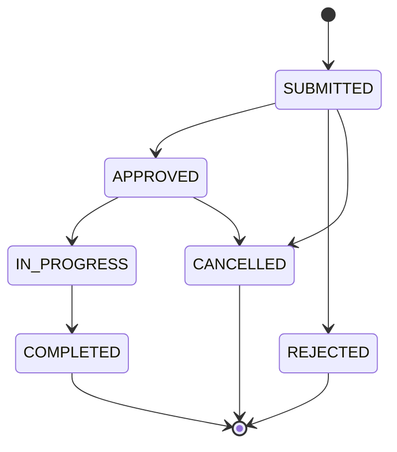
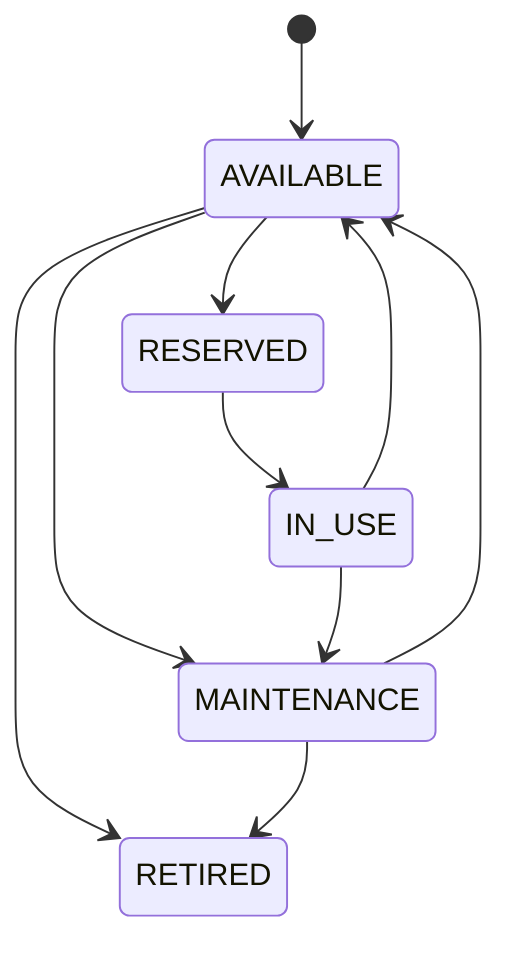
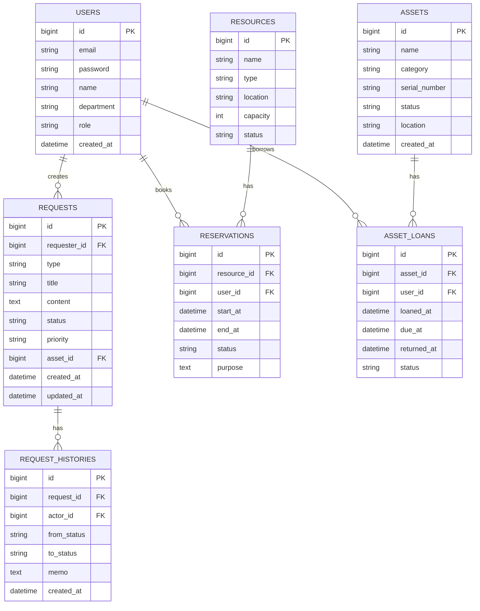

# OfficeOps Hub 프로젝트 기획서

## 1. 프로젝트 개요

`OfficeOps Hub`는 사내에서 발생하는 요청, 자산, 예약 업무를 한곳에서 관리하는 통합 운영 시스템이다.

직원은 비품 요청, 업무 지원 요청, 회의실 예약, 방문 신청 등을 등록할 수 있고, 관리자는 요청을 검토해 승인, 반려, 처리 완료 상태로 관리한다. 모든 상태 변경은 이력으로 남기며, 관리자는 대시보드에서 전체 운영 현황을 확인할 수 있다.

핵심 흐름은 다음과 같다.

```text
직원이 요청한다
-> 관리자가 확인한다
-> 승인, 반려, 처리 중, 완료 상태로 변경한다
-> 자산 또는 예약 상태가 함께 변경된다
-> 모든 처리 과정이 이력으로 남는다
```

## 2. 추천 이유

이 주제는 신입 개발자 포트폴리오에 적합하다.

- 단순 게시판보다 실무 서비스에 가깝다.
- CRUD, 권한, 상태 관리, 검색, 필터, 통계 기능을 자연스럽게 포함할 수 있다.
- 사용자 화면과 관리자 화면이 명확하게 나뉜다.
- Spring Boot, Vue.js, PostgreSQL 같은 기술 스택을 활용하기 좋다.
- 팀원 2명이 역할을 나누어 개발하기 좋다.
- 기능 범위를 조절하기 쉬워 한 달 이상 프로젝트에 적합하다.
- Docker, AWS 배포, 파일 첨부, 알림, AI 요약 등으로 확장하기 좋다.

## 3. 주요 사용자

| 역할 | 설명 | 주요 기능 |
| --- | --- | --- |
| 일반 직원 | 사내 요청과 예약을 등록하는 사용자 | 요청 등록, 내 요청 조회, 예약 신청, 요청 취소 |
| 관리자 | 요청, 자산, 예약을 관리하는 운영 담당자 | 전체 요청 조회, 승인/반려, 자산 관리, 예약 관리, 통계 확인 |

초기 버전에서는 `일반 직원`과 `관리자` 두 권한만 사용한다. 이후 필요하면 부서 관리자, 총관리자 권한을 추가할 수 있다.

## 4. 서비스 메뉴 구조

| 메뉴 | 설명 |
| --- | --- |
| 대시보드 | 요청 현황, 처리율, 예약 현황, 자산 사용률 확인 |
| 내 요청 | 내가 등록한 요청 목록과 상태 확인 |
| 요청 등록 | 비품 요청, 업무 지원 요청, 방문 신청 등록 |
| 자산 관리 | 비품, 장비, 소프트웨어 라이선스 목록과 상태 관리 |
| 예약 관리 | 회의실, 좌석, 공용 장비 예약 |
| 관리자 요청함 | 전체 요청 검토, 승인, 반려, 담당자 메모 입력 |
| 이력 관리 | 요청 상태 변경, 승인, 반려, 반납 기록 조회 |

## 5. 핵심 모듈

| 모듈 | 핵심 기능 |
| --- | --- |
| 사용자/인증 모듈 | 회원가입, 로그인, 로그아웃, 권한 분리 |
| 요청 모듈 | 요청 등록, 조회, 수정, 취소, 승인, 반려 |
| 자산 모듈 | 자산 등록, 수정, 상태 변경, 대여, 반납 |
| 예약 모듈 | 회의실/좌석/공용 장비 예약, 시간 중복 방지 |
| 이력 모듈 | 요청 상태 변경 이력, 자산 대여/반납 이력 저장 |
| 대시보드 모듈 | 월별 요청 수, 처리 완료율, 자산 사용 현황 통계 |

## 6. 요청 유형

| 요청 유형 | 예시 |
| --- | --- |
| 비품 요청 | 노트북, 모니터, 키보드, 마우스 대여 신청 |
| 구매 요청 | 사무용품, 소프트웨어, 장비 구매 요청 |
| 업무 지원 요청 | 계정 생성, 권한 요청, 문서 출력 요청 |
| 방문 신청 | 외부 방문자 등록, 방문 시간 신청 |
| 시설 요청 | 회의실 장비 고장, 좌석 변경, 시설 점검 요청 |

초기 MVP에서는 `비품 요청`, `회의실 예약`, `방문 신청` 중심으로 시작하는 것을 권장한다.

## 7. 요청 상태 흐름

요청 상태 관리는 이 프로젝트의 핵심 포트폴리오 포인트다.



| 상태 | 의미 |
| --- | --- |
| SUBMITTED | 요청 접수 |
| APPROVED | 승인됨 |
| REJECTED | 반려됨 |
| IN_PROGRESS | 처리 중 |
| COMPLETED | 완료 |
| CANCELLED | 취소 |

상태 전이 규칙 예시는 다음과 같다.

- 일반 직원은 요청을 등록하고 취소할 수 있다.
- 일반 직원은 요청을 직접 승인하거나 완료 처리할 수 없다.
- 관리자는 접수된 요청을 승인하거나 반려할 수 있다.
- 완료된 요청은 수정하거나 취소할 수 없다.
- 상태가 변경될 때마다 변경 이력을 저장한다.

## 8. 자산 상태 흐름

자산은 노트북, 모니터, 키보드, 회의 장비, 소프트웨어 라이선스 등을 의미한다.



| 상태 | 의미 |
| --- | --- |
| AVAILABLE | 사용 가능 |
| RESERVED | 예약됨 |
| IN_USE | 사용 중 |
| MAINTENANCE | 수리/점검 중 |
| RETIRED | 폐기 |

자산 관리에서는 현재 사용자가 누구인지, 대여일과 반납 예정일이 언제인지, 상태가 언제 변경되었는지를 추적한다.

## 9. 예약 관리 구조

예약 대상은 회의실, 좌석, 공용 장비로 설정할 수 있다.

예약 관리에서 가장 중요한 기능은 중복 예약 방지다.

예를 들어 기존 예약이 다음과 같을 때:

```text
회의실 A: 2026-06-10 10:00 ~ 11:00
```

아래 예약은 시간이 겹치므로 막아야 한다.

```text
회의실 A: 2026-06-10 10:30 ~ 11:30
```

예약 충돌 조건은 다음과 같다.

```text
새 예약 시작 시간 < 기존 예약 종료 시간
AND
새 예약 종료 시간 > 기존 예약 시작 시간
```

이 로직은 백엔드 설계 역량을 보여주기 좋은 부분이다.

## 10. 추천 DB 구조

초기 설계는 다음 테이블을 기준으로 잡는다.



## 11. 백엔드 패키지 구조

Spring Boot 기준 추천 구조는 다음과 같다.

```text
com.officeops
 ├─ auth
 │   ├─ controller
 │   ├─ service
 │   ├─ dto
 │   └─ security
 ├─ user
 ├─ request
 │   ├─ controller
 │   ├─ service
 │   ├─ repository
 │   ├─ entity
 │   └─ dto
 ├─ asset
 ├─ reservation
 ├─ dashboard
 ├─ history
 └─ common
     ├─ exception
     ├─ response
     └─ config
```

기능별 패키지 구조를 사용하면 팀원이 역할을 나누기 쉽고, 면접에서 구조 설명도 수월하다.

## 12. 프론트엔드 구조

Vue.js 기준 추천 구조는 다음과 같다.

```text
src
 ├─ api
 │   ├─ authApi.js
 │   ├─ requestApi.js
 │   ├─ assetApi.js
 │   └─ reservationApi.js
 ├─ router
 ├─ stores
 ├─ views
 │   ├─ LoginView.vue
 │   ├─ DashboardView.vue
 │   ├─ MyRequestsView.vue
 │   ├─ RequestDetailView.vue
 │   ├─ RequestCreateView.vue
 │   ├─ AssetListView.vue
 │   ├─ ReservationView.vue
 │   └─ AdminRequestView.vue
 └─ components
     ├─ layout
     ├─ forms
     ├─ tables
     └─ charts
```

초기 화면은 다음 6개만 우선 구현한다.

| 화면 | 설명 |
| --- | --- |
| 로그인 | 로그인, 회원가입 |
| 대시보드 | 주요 현황 카드와 차트 |
| 내 요청 목록 | 내가 등록한 요청 조회 |
| 요청 등록 | 요청 유형별 등록 |
| 예약 화면 | 자원 선택, 날짜/시간 선택 |
| 관리자 요청함 | 승인, 반려, 상태 변경 |

## 13. 대표 API 설계

```text
POST   /api/auth/login
POST   /api/auth/signup
GET    /api/users/me

GET    /api/requests
POST   /api/requests
GET    /api/requests/{id}
PATCH  /api/requests/{id}
PATCH  /api/requests/{id}/status
DELETE /api/requests/{id}

GET    /api/assets
POST   /api/assets
GET    /api/assets/{id}
PATCH  /api/assets/{id}
PATCH  /api/assets/{id}/status
POST   /api/assets/{id}/loans
PATCH  /api/asset-loans/{id}/return

GET    /api/resources
POST   /api/resources
GET    /api/reservations
POST   /api/reservations
PATCH  /api/reservations/{id}/cancel

GET    /api/dashboard/summary
GET    /api/dashboard/requests/monthly
GET    /api/dashboard/assets/status
```

## 14. 권한 설계

| 기능 | 일반 직원 | 관리자 |
| --- | --- | --- |
| 내 요청 등록 | 가능 | 가능 |
| 내 요청 조회 | 가능 | 가능 |
| 요청 수정/취소 | 본인 요청만 가능 | 가능 |
| 전체 요청 조회 | 불가 | 가능 |
| 승인/반려 | 불가 | 가능 |
| 자산 조회 | 가능 | 가능 |
| 자산 등록/수정 | 불가 | 가능 |
| 예약 등록 | 가능 | 가능 |
| 전체 예약 관리 | 불가 | 가능 |
| 전체 통계 조회 | 제한 | 가능 |

권한은 `ROLE_USER`, `ROLE_ADMIN`으로 시작한다.

## 15. MVP 범위

한 달 기준 MVP는 다음 기능까지를 목표로 한다.

| 구분 | 기능 |
| --- | --- |
| 인증 | 회원가입, 로그인, 권한 분리 |
| 요청 | 요청 등록, 목록 조회, 상세 조회, 수정, 취소 |
| 관리자 | 전체 요청 조회, 승인, 반려, 처리 중, 완료 처리 |
| 자산 | 자산 목록 조회, 자산 등록, 상태 변경 |
| 예약 | 회의실 예약 등록, 예약 목록 조회, 중복 예약 방지 |
| 이력 | 요청 상태 변경 이력 저장 |
| 검색/필터 | 요청 상태, 요청 유형, 날짜 기준 필터 |
| 대시보드 | 요청 건수, 처리 완료율, 자산 상태 현황 |

MVP 핵심 문장은 다음과 같다.

```text
비품 요청 + 회의실 예약 + 관리자 승인 + 상태 이력 + 대시보드
```

## 16. 확장 기능

시간이 남으면 아래 기능을 추가한다.

| 기능 | 포트폴리오 효과 |
| --- | --- |
| 파일 첨부 | 실무형 요청 시스템 느낌 강화 |
| 댓글/관리자 메모 | 처리 과정 커뮤니케이션 표현 |
| 알림 | 승인/반려 시 사용자 알림 |
| CSV 다운로드 | 관리자 기능 완성도 상승 |
| Docker 배포 | 운영 환경 이해도 어필 |
| AWS 배포 | 실제 서비스 배포 경험 어필 |
| AI 요약 | 요청 내용 요약, 처리 메모 초안 생성 |

초기부터 모든 확장 기능을 넣지 않는다. MVP 완성 후 우선순위를 정해 추가한다.

## 17. 추천 기술 스택

| 영역 | 추천 기술 |
| --- | --- |
| Backend | Java, Spring Boot, Spring Security, Spring Data JPA |
| Database | PostgreSQL |
| Frontend | Vue.js |
| UI | Tailwind CSS 또는 Bootstrap |
| API 문서 | Swagger/OpenAPI |
| 협업 | GitHub Issues, GitHub Projects, Notion, Figma |
| 배포 | Docker, AWS EC2, AWS RDS |
| 테스트 | JUnit, Spring Boot Test |

React와 TypeScript는 필수는 아니다. 이미 Vue.js 경험이 있다면 Vue.js로 완성도를 높이는 편이 안전하다. 새로 학습할 기술은 Spring Security, Docker, AWS 배포 정도로 제한하는 것을 권장한다.

## 18. 팀원 2명 역할 분담

| 역할 | 담당 업무 |
| --- | --- |
| 팀원 A | 백엔드 중심: 인증/권한, 요청 API, 승인 상태, DB 설계, 상태 이력 |
| 팀원 B | 프론트엔드 중심: Vue 화면, 라우팅, 요청 목록/상세/등록, 관리자 화면 |
| 공통 | ERD, API 명세, Figma, GitHub 이슈 관리, 배포, README |

역할을 완전히 분리하기보다 서로의 코드를 리뷰하고, 핵심 기능은 함께 설계하는 것이 좋다.

## 19. 추천 일정

### 4주 MVP 일정

| 주차 | 목표 |
| --- | --- |
| 1주차 | 요구사항 정리, ERD, API 명세, Figma, 프로젝트 세팅 |
| 2주차 | 로그인/권한, 요청 CRUD, 기본 레이아웃 구현 |
| 3주차 | 승인/반려, 상태 이력, 예약 중복 방지, 자산 상태 관리 |
| 4주차 | 검색/필터, 대시보드, 예외 처리, UI 정리, README 작성 |

### 6~8주 확장 일정

| 기간 | 목표 |
| --- | --- |
| 5~6주차 | 파일 첨부, 알림, 댓글/관리자 메모, 테스트 보강 |
| 7~8주차 | Docker, AWS 배포, 발표 자료, 트러블슈팅 문서화 |

## 20. 포트폴리오 어필 포인트

면접과 README에서 강조할 포인트는 다음과 같다.

- 단순 게시판이 아니라 실제 회사 내부 운영 흐름을 모델링했다.
- 사용자와 관리자 권한을 분리했다.
- 요청 상태 전이를 설계하고 잘못된 상태 변경을 제한했다.
- 예약 시간 충돌 방지 로직을 구현했다.
- 자산 대여, 반납, 점검, 폐기 상태를 관리했다.
- 상태 변경 이력을 저장해 운영 추적성을 확보했다.
- 검색, 필터, 정렬, 통계 대시보드를 구현했다.
- Docker와 AWS를 활용해 실제 배포 환경을 구성했다.

면접 설명 예시는 다음과 같다.

```text
단순 CRUD 서비스가 아니라 실제 회사 내부 운영 흐름을 모델링했습니다.
요청의 상태 전이를 설계했고, 사용자/관리자 권한 분리, 처리 이력 저장,
예약 충돌 방지, 자산 상태 변경을 구현했습니다.
```

## 21. 주의할 점

- 처음부터 통합 시스템 전체를 만들려고 하면 범위가 커진다.
- 조직도, 복잡한 결재선, 실시간 채팅, AI 기능은 MVP 이후로 미룬다.
- 관리자 화면을 너무 화려하게 만들기보다 사용성과 데이터 흐름을 우선한다.
- 예약 중복 방지와 상태 변경 제한은 반드시 테스트한다.
- README, ERD, API 명세, 트러블슈팅 문서를 함께 준비한다.

## 22. 최종 추천 범위

최종적으로 아래 범위를 1차 목표로 잡는 것을 추천한다.

```text
OfficeOps Hub

핵심 기능:
- 회원가입/로그인
- 일반 직원/관리자 권한 분리
- 비품 요청 등록 및 승인
- 회의실 예약 및 중복 예약 방지
- 자산 목록 및 상태 관리
- 요청 상태 변경 이력
- 관리자 대시보드
- 검색/필터

확장 기능:
- 파일 첨부
- 알림
- CSV 다운로드
- Docker/AWS 배포
- AI 요청 요약
```

이 범위는 팀원 2명이 한 달 이상 진행하기에 현실적이며, 기간을 6~8주로 늘리면 배포와 문서화까지 포함한 완성도 높은 신입 개발자 포트폴리오로 만들 수 있다.
