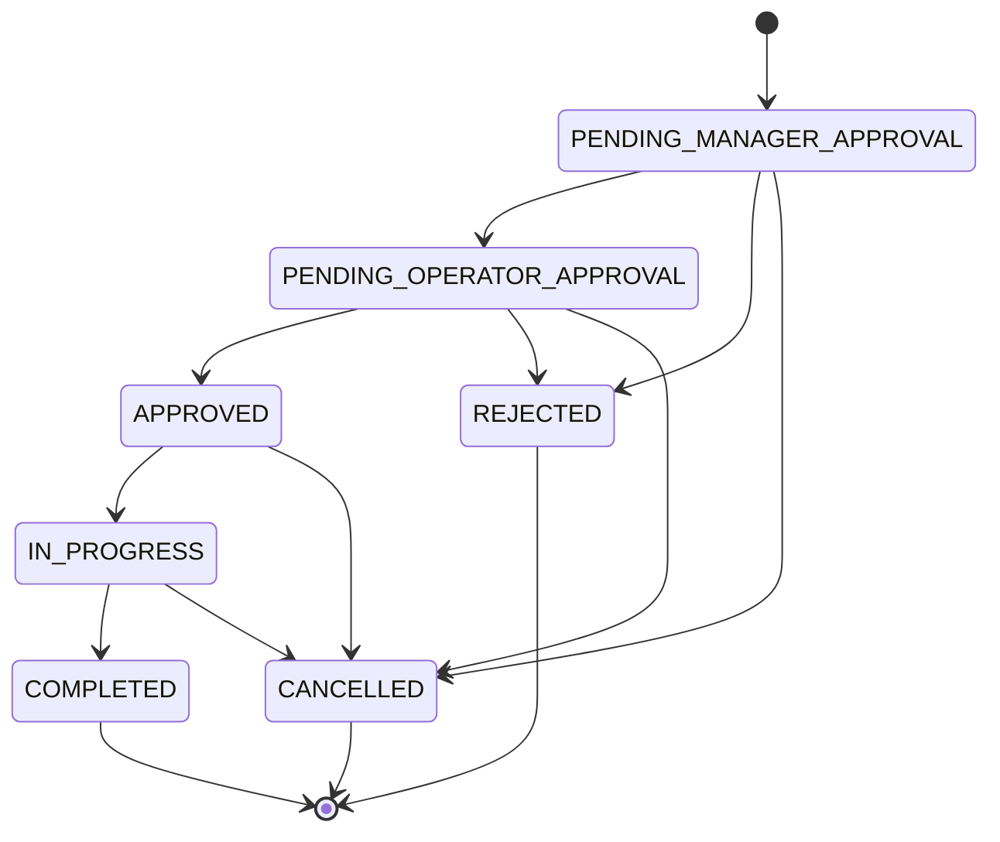

# OfficeOps Hub 프로젝트 개요서
## 문서 버전 이력

| 버전 | 구분 | 수정 사항 | 삭제 사항 |
| --- | --- | --- | --- |
| v1.4.0 | 문서별 독립 버전 관리 정책 반영 | 문서마다 실제 업데이트 여부를 기준으로 버전을 상승시키고, 수정된 문서의 파일명과 참조 링크만 함께 갱신하도록 규칙 정리 | 전체 문서 버전을 일괄로 맞춘다는 해석 제거 |
| v1.5.0 | 로컬/원격 브랜치 생성 지침 반영 | 협업 방식에 `dev` 하위 브랜치, 기능/문서/기타 작업별 브랜치 네이밍, PR 대상 `dev` 고정 규칙 반영 | `develop` 기준 브랜치 예시 제거 |
| v1.6.0 | 원격 업로드 요청 처리 지침 반영 | 산출물 목록의 팀 운영 문서 링크를 원격 업로드 요청 처리 규칙이 포함된 버전으로 갱신 | 없음 |
| v1.7.0 | 보조 도구 작업 흔적 비노출 지침 반영 | 산출물 목록의 팀 운영 문서 링크를 보조 도구 작업 흔적 비노출 규칙이 반영된 버전으로 갱신 | 없음 |
| v1.8.0 | 브랜치 생성 절차 보강 반영 | 산출물 목록의 팀 운영 문서 링크를 브랜치 생성 절차가 보강된 버전으로 갱신 | 없음 |
| v1.3.0 | 파일명 버전 최신화 규칙 반영 | 문서 파일명의 버전을 문서 내부 최신 버전과 동일하게 관리하도록 정리하고, 이후 수정 및 버전 상승 시 파일명과 참조 링크를 즉시 갱신하는 규칙 추가 | 최신 버전과 맞지 않는 파일명 버전 표기 제거 |
| v1.2.0 | 문서 네이밍 및 버전 관리 체계 정리 | 문서 파일명을 번호 없는 한글 제목 기반 규칙으로 정리하고 버전 표기를 semantic version 형식으로 통일 | 문서 번호 접두어와 영문 기반 산출물 파일명 제거 |
| v1.0.0 | 최초 기준선 | 기존 문서 내용 기준선 | 없음 |


## 1. Executive Summary / 한 페이지 요약

### 프로젝트 기본 정보

| 항목 | 내용 |
| --- | --- |
| 프로젝트명 | OfficeOps Hub |
| 프로젝트 성격 | 팀 프로젝트, 사내 운영/HR/전자결재 관리 웹 애플리케이션 |
| 개발 기간 | 4주 MVP, 6~8주 확장 가능 |
| 최종 산출물 | 백엔드 API 서버, 프론트엔드 웹 애플리케이션, DB 설계, API 문서, README, 발표자료 |
| 핵심 기술 | Java 21, Spring Boot 3, React, PostgreSQL, Docker Compose |

### 한 줄 요약

`OfficeOps Hub`는 사내 비품 요청, 방문 신청, 시설 요청, 회의실 예약, 자산 대여/반납, 근태 관리, 전자결재 업무를 한곳에서 관리하는 팀 프로젝트 기반 사내 운영/HR 플랫폼이다.

### 프로젝트 개요

회사 내부 운영 업무와 HR 업무는 요청 등록, 팀장 승인, 운영/HR/재무 담당자 처리, 자산 대여, 회의실 예약, 연차 신청, 증명서 발급, 지출결의처럼 여러 사람과 상태를 거쳐 진행된다. 하지만 이런 업무가 메신저, 메일, 엑셀, 구두 요청으로 흩어지면 처리 상태를 추적하기 어렵고, 담당자 배정이나 마감 관리도 누락되기 쉽다.

`OfficeOps Hub`는 이러한 사내 운영 업무와 HR 업무를 하나의 웹 시스템으로 통합한다. 일반 직원은 요청, 예약, 근태 신청, 전자결재 문서를 등록하고 진행 상태를 확인할 수 있으며, 팀장은 소속 팀원의 요청과 전자결재 문서를 1차 승인하거나 반려한다. 운영 담당자는 팀장 승인 완료 운영 요청을 최종 승인하고 담당자와 마감일을 지정한 뒤 처리 상태를 관리한다. HR 담당자는 연차, 출퇴근, 근무제, 증명서 발급 요청을 관리하고, 재무 담당자는 지출결의서와 법인카드 사용내역서를 처리한다. 관리자는 전체 요청, 예약, 자산, 사용자, 근태, 전자결재, 감사 이력을 조회하고 대시보드에서 운영 현황을 확인한다.

이 프로젝트는 단순 CRUD를 넘어 권한 분리, 상태 전이, 예약 중복 방지, 자산 상태 관리, 감사 로그, 검색/필터/페이지네이션, 대시보드까지 포함해 실제 업무 시스템에 가까운 구조를 구현하는 것을 목표로 한다.

### 핵심 내용

- 해결하려는 문제: 사내 운영 요청과 예약, 자산 관리가 분산되어 처리 현황과 책임 소재를 추적하기 어려움
- 주요 대상 사용자: 일반 직원, 팀장, 운영 담당자, HR 담당자, 재무 담당자, 관리자
- 제안하는 해결 방법: 요청/승인/처리/예약/자산/근태/전자결재/이력을 통합 관리하는 웹 애플리케이션 구축
- 기대 효과: 요청 처리 투명성 향상, 예약 충돌 방지, 자산 대여 이력 추적, 연차/근태 관리 자동화, 전자결재 처리 가시화
- 최종 결과물: Spring Boot REST API, React 웹 화면, PostgreSQL DB, Swagger API 문서, Docker Compose 개발 환경

## 2. 배경 및 문제 정의

### 추진 배경

- 사내 비품 요청, 시설 요청, 방문 신청, 회의실 예약은 반복적으로 발생하는 운영 업무다.
- 요청 처리에는 요청자, 팀장, 운영 담당자, 관리자 등 여러 역할이 관여한다.
- 업무가 메신저나 엑셀 중심으로 처리되면 처리 상태, 담당자, 마감일, 승인 이력을 일관되게 관리하기 어렵다.
- 포트폴리오 관점에서도 권한, 상태 전이, 예약 충돌, 이력 저장 같은 실무형 백엔드/프론트엔드 역량을 보여주기 좋은 주제다.

### 현재 상황

- 요청 처리 상태가 흩어져 있어 사용자가 진행 상황을 확인하기 어렵다.
- 팀장 승인과 운영 담당자 최종 승인 흐름이 명확히 기록되지 않는다.
- 회의실 예약은 시간 중복을 시스템적으로 차단해야 한다.
- 자산 대여/반납 이력이 없으면 현재 사용자를 추적하기 어렵다.
- 관리자 입장에서는 지연 요청, 미배정 요청, 자산 상태, 예약 현황을 한눈에 보기 어렵다.

### 문제 정의

```text
우리는 사내 직원과 운영 담당자가 요청, 예약, 자산 업무를 처리하는 과정에서 겪는 상태 추적, 권한 관리, 이력 누락, 예약 충돌 문제를 해결하고자 한다.
```

## 3. 대상 사용자

| 사용자 | 권한 코드 | 주요 니즈 | 프로젝트를 통해 얻는 가치 |
| --- | --- | --- | --- |
| 일반 직원 | ROLE_USER | 요청 등록, 예약 신청, 내 요청 상태 확인 | 요청 처리 현황을 직접 확인하고 필요한 업무를 빠르게 신청 |
| 팀장 | ROLE_MANAGER | 소속 팀원 요청 검토 | 팀 단위 요청을 1차 승인/반려하고 승인 책임을 명확히 기록 |
| 운영 담당자 | ROLE_OPERATOR | 최종 승인, 담당자 지정, 처리 상태 관리 | 운영 요청을 체계적으로 배정하고 마감일 기준으로 관리 |
| HR 담당자 | ROLE_HR | 연차/근태/증명서 관리 | 근태 현황과 증명서 발급 요청을 체계적으로 처리 |
| 재무 담당자 | ROLE_FINANCE | 지출결의서/법인카드 내역 처리 | 비용 결재와 정산 처리 상태를 명확히 관리 |
| 관리자 | ROLE_ADMIN | 전체 운영 현황 관리 | 요청, 예약, 자산, 사용자, 감사 이력을 통합 관리 |

## 4. 프로젝트 목표

### 핵심 목표

- 사내 요청, 예약, 자산 관리 업무를 하나의 서비스에서 처리한다.
- 사내 근태, 연차, 전자결재 문서 신청과 승인 업무를 하나의 서비스에서 처리한다.
- 일반 직원, 팀장, 운영 담당자, HR 담당자, 재무 담당자, 관리자 권한을 분리한다.
- 요청 상태 전이를 정책화하고 잘못된 상태 변경을 차단한다.
- 회의실 예약의 시간 중복을 서버에서 검증한다.
- 자산 대여/반납 이력을 저장해 사용 현황을 추적한다.
- 관리자 대시보드로 운영 현황을 시각화한다.

### 완료 기준

- 로그인/회원가입과 JWT 기반 인증이 동작한다.
- 권한별 API 접근 제한과 화면 접근 제한이 동작한다.
- 요청 등록부터 팀장 승인, 운영 최종 승인, 처리 중, 완료까지 흐름이 구현된다.
- 모든 요청 상태 변경과 승인 이력이 저장된다.
- 회의실 예약 중복 방지 로직이 테스트로 검증된다.
- 자산 대여/반납 시 자산 상태와 대여 이력이 함께 변경된다.
- 주요 목록은 검색, 필터, 페이지네이션을 지원한다.
- Swagger 또는 OpenAPI로 API 명세를 확인할 수 있다.

## 5. 해결 방법 및 핵심 전략

### 해결 방향

OfficeOps Hub는 요청 중심 상태 머신을 핵심으로 설계한다. 요청은 생성 후 팀장 승인, 운영 담당자 승인, 담당자 배정, 처리 중, 완료 흐름을 거친다. 각 단계는 역할별 권한과 상태 전이 규칙에 의해 제한되며, 변경 내용은 이력과 감사 로그로 저장된다.

예약은 같은 자원에 대해 시간이 겹치는 예약을 서버에서 차단한다. 자산은 상태와 대여 이력을 분리해 자산 자체의 현재 상태와 사용자별 대여 내역을 모두 추적한다.

### 핵심 업무 흐름

```text
사용자 요청 등록
-> 팀장 1차 승인 또는 반려
-> 운영 담당자 최종 승인 또는 반려
-> 담당자 지정 및 처리 예정일/마감일 설정
-> 처리 중
-> 완료
-> 상태 변경 이력과 감사 이력 저장
```

### 주요 기능

| 영역 | 주요 기능 |
| --- | --- |
| 인증/인가 | 회원가입, 로그인, JWT 인증, 권한별 접근 제어, 사용자 비활성화 |
| 요청 | 요청 등록, 목록/상세 조회, 수정, 취소, 유형별 추가 입력값 |
| 승인 | 팀장 1차 승인/반려, 운영 담당자 최종 승인/반려 |
| 처리 | 담당자 지정, 처리 예정일/마감일 관리, 처리 중/완료 상태 변경 |
| 예약 | 회의실/자원 예약, 중복 예약 방지, 예약 취소, 예약 캘린더 |
| 자산 | 자산 목록, 등록/수정, 상태 변경, 대여/반납 이력 |
| 관리자 | 대시보드, 전체 요청/예약/자산/자원/사용자/감사 이력 관리 |
| 근태 | 내 연차 현황, 연차 사용 내역, 출퇴근 기록, 근무시간 조회 |
| 전자결재 | 연차/근무제/증명서/지출/법인카드 문서 작성, 상신, 승인, 반려, 완료 |
| 공통 | 검색, 필터, 페이지네이션, 공통 응답, 공통 예외, Swagger 문서 |

### 차별점

- 단순 게시판이 아니라 실제 사내 운영 프로세스를 상태 전이로 모델링한다.
- 프론트엔드 버튼 제어뿐 아니라 백엔드 서비스 계층에서 권한과 상태를 재검증한다.
- 예약 충돌 조건과 자산 대여/반납 상태 변경처럼 실무형 비즈니스 규칙을 포함한다.
- 감사 로그와 변경 이력을 통해 운영 추적성을 확보한다.

## 6. MVP 범위

### 1차 MVP 필수 범위

| 구분 | 기능 |
| --- | --- |
| 인증 | 회원가입, 로그인, 로그아웃, 내 정보 조회, 사용자 비활성화 |
| 권한 | ROLE_USER, ROLE_MANAGER, ROLE_OPERATOR, ROLE_HR, ROLE_FINANCE, ROLE_ADMIN 분리 |
| 요청 | 요청 등록, 내 요청 목록/상세, 수정, 취소 |
| 승인 | 팀장 1차 승인/반려, 운영 담당자 최종 승인/반려 |
| 처리 | 담당자 지정, 마감일 설정, 처리 중, 완료 |
| 이력 | 요청 상태 변경 이력, 승인 이력, 관리자 감사 이력 |
| 예약 | 회의실 예약, 내 예약 목록, 예약 취소, 중복 예약 방지 |
| 자원 | 회의실/자원 목록, 관리자 자원 등록/수정/상태 변경 |
| 자산 | 자산 목록, 관리자 자산 등록/수정/상태 변경, 대여/반납 |
| 관리자 | 대시보드, 전체 요청 관리, 예약 관리, 감사 이력 |
| 근태 | 내 연차 현황, 연차 사용 내역, 출퇴근 기록, 근무시간 조회 |
| 전자결재 | 전자결재 작성/상신/승인/반려, 연차/증명서/비용 문서 처리 |
| 공통 | 404, 권한 없음, 검색/필터/페이지네이션, Swagger |

### 2순위

- 요청 댓글/처리 코멘트
- 인앱 알림 목록
- 지연 요청/미배정 요청 대시보드
- 자산 상태 변경 이력
- 사용자 권한 변경 이력
- 예약 캘린더
- 내 자산 대여 현황

### MVP 이후

- 비밀번호 변경
- Refresh Token 재발급
- 파일 첨부
- 이메일 알림
- CSV 다운로드
- 반복 예약
- 휴일/운영 시간 관리
- AI 요청 요약

## 7. 기술 스택

### Backend

| 기술 | 사용 목적 |
| --- | --- |
| Java 21 | 백엔드 메인 언어 |
| Spring Boot 3 | REST API 서버 |
| Spring Security 6 | 인증/인가 |
| JWT | Access Token 기반 인증 |
| Spring Data JPA | ORM, 데이터 접근 |
| PostgreSQL | 관계형 데이터베이스 |
| Flyway | DB 마이그레이션 |
| Bean Validation | 입력값 검증 |
| Swagger/OpenAPI | API 문서화 |
| JUnit 5, Mockito | 단위/통합 테스트 |

### Frontend

| 기술 | 사용 목적 |
| --- | --- |
| React | UI 구현 |
| Vite | 개발 서버와 빌드 |
| React Router | 라우팅과 화면 보호 |
| Axios | API 요청 |
| TanStack Query | 서버 상태 관리 |
| Zustand | 인증 정보와 UI 상태 관리 |
| Tailwind CSS | 스타일링 |
| React Hook Form, Zod | 폼 상태와 입력값 검증 |
| Chart.js 또는 ApexCharts | 대시보드 차트 |

### Infra / Collaboration

| 기술 | 사용 목적 |
| --- | --- |
| Docker Compose | 로컬 개발 환경 구성 |
| AWS EC2 | 서버 배포 |
| AWS RDS PostgreSQL | 운영 DB |
| Nginx | 정적 파일 서빙, Reverse Proxy |
| GitHub Actions | CI/CD |
| GitHub Issues / Projects | 작업 관리 |
| Figma 또는 Fluid UI | 화면 흐름과 와이어프레임 |

## 8. 아키텍처 및 구조

### 권장 프로젝트 구조

```text
officeops-hub
 ├─ backend
 │   ├─ src
 │   ├─ build.gradle
 │   └─ Dockerfile
 ├─ frontend
 │   ├─ src
 │   ├─ package.json
 │   └─ Dockerfile
 ├─ docs
 ├─ docker-compose.yml
 └─ README.md
```

### 백엔드 패키지 구조

```text
com.officeops
 ├─ auth
 ├─ user
 ├─ request
 ├─ approval
 ├─ asset
 ├─ reservation
 ├─ resource
 ├─ dashboard
 ├─ audit
 └─ common
```

### 프론트엔드 디렉터리 구조

```text
src
 ├─ api
 ├─ app
 ├─ components
 ├─ features
 ├─ hooks
 ├─ pages
 ├─ stores
 └─ utils
```

## 9. 상태 및 권한 설계

### 요청 상태 흐름



### 권한 정책 요약

| 기능 | ROLE_USER | ROLE_MANAGER | ROLE_OPERATOR | ROLE_ADMIN |
| --- | --- | --- | --- | --- |
| 요청 등록/내 요청 조회 | 가능 | 가능 | 가능 | 가능 |
| 팀장 승인/반려 | 불가 | 소속 팀 | 불가 | 가능 |
| 운영 최종 승인/반려 | 불가 | 불가 | 가능 | 가능 |
| 담당자 지정/처리 상태 변경 | 불가 | 불가 | 가능 | 가능 |
| 예약 등록 | 가능 | 가능 | 가능 | 가능 |
| 전체 예약 관리 | 불가 | 불가 | 가능 | 가능 |
| 자산 등록/수정 | 불가 | 불가 | 가능 | 가능 |
| 자원 관리 | 불가 | 불가 | 불가 | 가능 |
| 사용자 관리/감사 이력 | 불가 | 불가 | 불가 | 가능 |

## 10. 데이터베이스 설계 요약

| 테이블 | 역할 |
| --- | --- |
| users | 사용자 정보, 권한, 상태, 소속 부서, 팀장 관계 |
| departments | 부서 마스터 |
| code_groups, code_items | 공통 코드/마스터 데이터 |
| requests | 요청 본문 |
| request_details | 요청 유형별 추가 입력값 |
| request_approvals | 승인/반려 이력 |
| request_histories | 요청 상태 변경 이력 |
| request_comments | 요청 댓글/처리 코멘트 |
| resources | 회의실/예약 자원 |
| reservations | 예약 정보 |
| reservation_histories | 예약 상태 변경/취소 이력 |
| assets | 자산 정보 |
| asset_loans | 자산 대여/반납 이력 |
| asset_histories | 자산 상태 변경 이력 |
| notifications | 인앱 알림 |
| audit_logs | 관리자/운영 담당자 감사 이력 |
| attachments | 요청 첨부파일 |

상세 DB 설계는 `docs/specifications/OfficeOps_hub_데이터베이스설계서_v1.3.0.md`를 기준으로 한다.

## 11. API 설계 요약

| 영역 | 대표 API |
| --- | --- |
| 인증 | `POST /api/auth/signup`, `POST /api/auth/login`, `GET /api/users/me` |
| 요청 | `GET /api/requests`, `POST /api/requests`, `GET /api/requests/{id}`, `PATCH /api/requests/{id}` |
| 팀장 승인 | `GET /api/manager/approvals`, `PATCH /api/manager/approvals/{id}/approve`, `PATCH /api/manager/approvals/{id}/reject` |
| 운영 처리 | `GET /api/operator/requests`, `PATCH /api/operator/requests/{id}/approve`, `PATCH /api/operator/requests/{id}/complete` |
| 예약/자원 | `GET /api/resources`, `POST /api/reservations`, `PATCH /api/reservations/{id}/cancel` |
| 자산 | `GET /api/assets`, `POST /api/admin/assets`, `POST /api/admin/assets/{id}/loans`, `PATCH /api/admin/asset-loans/{id}/return` |
| 대시보드 | `GET /api/admin/dashboard/summary` |
| 감사 이력 | `GET /api/admin/audit-logs` |

상세 API 명세는 `docs/specifications/OfficeOps_hub_인터페이스명세서_v1.3.0.md`를 기준으로 한다.

## 12. 일정, 마일스톤, 산출물

### 4주 MVP 일정

| 기간 | 주요 활동 | 담당 |
| --- | --- | --- |
| 1주차 | 요구사항 확정, ERD, API 명세, 화면 흐름, 프로젝트 세팅 | 공통 |
| 2주차 | 인증/권한, 요청 CRUD, 기본 레이아웃, 라우팅 보호 | BE/FE |
| 3주차 | 팀장/운영 승인 흐름, 상태 이력, 예약 중복 방지, 자산 관리 | BE/FE |
| 4주차 | 대시보드, 검색/필터, 테스트, Swagger, README, 발표 준비 | 공통 |

### 마일스톤

| 마일스톤 | 완료 기준 | 관련 산출물 |
| --- | --- | --- |
| M1. 기획 확정 | 요구사항, 권한, MVP 범위 확정 | 요구사항 정의서, 기능 명세서 |
| M2. 설계 확정 | ERD, API, 화면 흐름 확정 | ERD, API 명세, 화면 정의서 |
| M3. 핵심 기능 완성 | 인증, 요청 승인 흐름, 예약, 자산 기능 구현 | 백엔드/프론트 MVP |
| M4. 검증 완료 | 필수 테스트와 수동 QA 시나리오 통과 | 테스트 계획서, 테스트 결과 |
| M5. 최종 제출 | README, 발표자료, 배포 또는 시연 환경 준비 | README, 발표자료, 데모 |

### 최종 산출물

| 산출물 | 설명 |
| --- | --- |
| 프로젝트 기획서 | 프로젝트 배경, 목표, 기능, 일정, 역할 정리 |
| 요구사항/기능 명세 | MVP 기능, 권한, 정책 정의 |
| ERD/DB 설계 | PostgreSQL 테이블과 관계 정의 |
| API 명세 | REST API, 요청/응답, 에러 코드 정의 |
| 화면 정의/흐름도 | React 화면 목록과 사용자 흐름 |
| 백엔드 서버 | Spring Boot REST API |
| 프론트엔드 앱 | React/Vite 웹 애플리케이션 |
| 테스트 계획 | 필수 테스트와 QA 시나리오 |
| README | 프로젝트 소개, 기술 스택, 실행 방법, 팀 프로젝트 정보 |

## 13. 팀원 구성 및 협업 방식

### 팀원 2명 기준 역할 분담

| 역할 | 담당 업무 |
| --- | --- |
| 팀원 A | 백엔드 중심: 인증/권한, 요청 API, 상태 전이, DB 설계, 이력 저장, 테스트 |
| 팀원 B | 프론트엔드 중심: React 화면, 라우팅, 요청/예약/자산 화면, 관리자 대시보드 |
| 공통 | 요구사항 정리, API 명세, ERD, GitHub Issues, README, 발표자료, 배포 |

### 협업 방식

- 기능 단위로 GitHub Issues를 생성한다.
- 작업 브랜치는 `dev` 하위 브랜치로 생성하고 PR 대상도 `dev`로 고정한다.
- 기능 구현은 `feature/feature_name`, 문서 작업은 `docs/docs_name` 형식으로 브랜치를 생성한다.
- 기능과 문서 외 작업은 작업 성격에 맞는 이름으로 브랜치를 생성한다.
- 하나의 작업 브랜치에서는 해당 기능 또는 해당 문서 작업만 진행한다.
- PR 작성 시 작업 내용, 테스트 결과, 문서 변경 여부를 함께 기록한다.
- API 변경 전에는 `docs/specifications/OfficeOps_hub_인터페이스명세서_v1.3.0.md`를 먼저 갱신한다.
- 상태/권한 변경 전에는 `docs/specifications/OfficeOps_hub_상태권한정책문서_v1.3.0.md`를 먼저 갱신한다.
- DB 변경 시 `docs/specifications/OfficeOps_hub_데이터베이스설계서_v1.3.0.md`와 Flyway migration을 함께 관리한다.

## 14. 리스크와 대응 방안

| 리스크 | 발생 가능성 | 영향도 | 대응 방안 |
| --- | --- | --- | --- |
| 기능 범위 과다 | 중 | 상 | MVP 필수 기능과 2순위 기능을 분리하고 요청 승인 흐름을 우선 완성 |
| 권한/상태 전이 복잡도 | 중 | 상 | 상태 전이 표를 기준으로 서비스 계층 테스트를 먼저 작성 |
| 예약 중복 로직 오류 | 중 | 중 | 겹치는 예약과 맞닿는 예약 케이스를 자동 테스트로 검증 |
| 역할 불균형 | 중 | 중 | 백엔드/프론트 중심 역할은 나누되 설계와 QA는 공동 진행 |
| 일정 지연 | 중 | 상 | 대시보드 고도화, 알림, 파일 첨부는 MVP 이후로 조정 |
| 배포 난이도 | 중 | 중 | 로컬 Docker Compose를 먼저 완성하고 AWS 배포는 확장 일정에서 진행 |

## 15. 테스트 전략

### 필수 테스트

- 로그인/회원가입, 비활성 사용자 로그인 차단
- 권한별 API 접근 제한
- 요청 등록/수정/취소
- 팀장 1차 승인/반려
- 운영 담당자 최종 승인/반려
- 담당자 지정, 처리 중, 완료 상태 변경
- 요청 상태 변경 이력과 승인 이력 저장
- 감사 이력 저장
- 예약 중복 방지
- 자산 대여/반납 상태 변경

### 핵심 QA 시나리오

```text
1. 일반 직원이 비품 요청을 등록한다.
2. 팀장이 소속 팀원 요청을 1차 승인한다.
3. 운영 담당자가 최종 승인하고 담당자와 마감일을 지정한다.
4. 담당자가 요청을 처리 중으로 변경한 뒤 완료 처리한다.
5. 요청자가 완료 상태를 확인한다.
6. 관리자가 감사 이력에서 승인과 담당자 지정 기록을 확인한다.
```

## 16. 성과 측정 및 기대 효과

### 성과 측정 방법

- 필수 MVP 기능 구현률
- 테스트 케이스 통과 여부
- 수동 QA 시나리오 성공 여부
- README와 문서 산출물 완성도
- 팀원별 역할 수행과 PR 리뷰 이력

### 기대 효과

- 사내 운영 업무 흐름을 실제 서비스처럼 모델링한 포트폴리오를 구성할 수 있다.
- Spring Security, JWT, JPA, 상태 전이, 예약 충돌 방지 같은 백엔드 핵심 역량을 보여줄 수 있다.
- React 기반 권한별 화면 분리, 서버 상태 관리, 폼 검증, 대시보드 구현 역량을 보여줄 수 있다.
- Docker, AWS, GitHub Actions까지 확장해 개발부터 배포까지의 경험을 정리할 수 있다.

## 17. 승인 및 의사결정 기준

### 승인 대상

| 승인 항목 | 승인 기준 | 승인 주체 |
| --- | --- | --- |
| MVP 범위 확정 | 필수 기능과 2순위 기능이 구분되어 있고 일정 내 구현 가능함 | 팀 전체 |
| DB/API 설계 확정 | ERD와 API 명세가 주요 기능 흐름을 모두 포함함 | 백엔드 담당, 프론트엔드 담당 |
| 화면 흐름 확정 | 주요 사용자 흐름과 권한별 진입 화면이 정의됨 | 프론트엔드 담당, 팀 전체 |
| 핵심 기능 완료 | 요청 승인 흐름, 예약 중복 방지, 자산 대여/반납이 동작함 | 팀 전체 |
| 최종 제출 승인 | README, 문서, 테스트, 시연 흐름이 준비됨 | 팀 전체 |

### 의사결정 원칙

- MVP 일정에 영향이 있는 기능은 팀 회의에서 우선순위를 조정한다.
- API, DB, 상태/권한 정책 변경은 관련 문서를 먼저 수정한 뒤 구현한다.
- 기능 범위가 충돌하면 요청 승인 흐름, 예약 중복 방지, 자산 대여/반납을 우선한다.
- 최종 제출 전에는 팀원 모두가 README, 주요 문서, 시연 흐름을 확인한다.

## 18. 참고 문서

| 문서 | 설명 |
| --- | --- |
| `docs/specifications/OfficeOps_hub_요구사항정의서_v1.3.0.md` | 요구사항 정의 |
| `docs/specifications/OfficeOps_hub_기능명세서_v1.3.0.md` | 기능 명세 |
| `docs/specifications/OfficeOps_hub_화면정의서_v1.3.0.md` | 화면 정의 |
| `docs/specifications/OfficeOps_hub_데이터베이스설계서_v1.3.0.md` | ERD/DB 설계 |
| `docs/specifications/OfficeOps_hub_인터페이스명세서_v1.3.0.md` | API 명세 |
| `docs/specifications/OfficeOps_hub_상태권한정책문서_v1.3.0.md` | 상태/권한 정책 |
| `docs/specifications/OfficeOps_hub_테스트계획서_v1.3.0.md` | 테스트 계획 |
| `docs/team_charter/OfficeOps_hub_팀운영문서_v1.8.0.md` | 팀 운영 및 협업 규칙 |
| `docs/specifications/OfficeOps_hub_화면흐름도_v1.3.0.md` | 화면 흐름도 |

## 19. HR/전자결재 확장 확정 사항

### 19.1 추가 도메인

OfficeOps Hub는 사내 운영 관리에서 전체 HR 포털 성격으로 확장한다. 기존 운영 요청, 예약, 자산 흐름은 유지하고, 근태/연차/전자결재 도메인을 같은 인증/권한/감사/알림 체계 안에 포함한다.

### 19.2 근태 범위

| 기능 | 설명 |
| --- | --- |
| 내 연차 현황 | 발생, 사용, 예정 차감, 잔여 연차 조회 |
| 연차 사용 내역 | 발생, 사용, 취소 복원, HR 조정 이력 조회 |
| 출퇴근 기록 | 출근, 퇴근, 휴게, 근무시간 기록 |
| 근무제 신청 | 재택, 외근, 출장, 시차출퇴근, 초과근무 신청 |
| 근태 리포트 | 팀/부서별 근무시간, 연차 사용, 누락 기록 집계 |

### 19.3 전자결재 문서 유형

| 문서 유형 | 최종 처리 |
| --- | --- |
| 연차 신청서, 연차 취소 신청서 | ROLE_HR |
| 재택근무, 외근, 출장, 시차출퇴근, 초과근무 신청서 | ROLE_HR |
| 재직증명서, 경력증명서 신청서 | ROLE_HR |
| 지출결의서, 법인카드 사용내역서 | ROLE_FINANCE |

기본 결재선은 `작성자 -> 팀장 -> HR/Finance 담당자 -> 완료`로 둔다. 대결, 위임, 병렬 합의, 외부 전자서명은 기본 구현 이후 확장한다.

### 19.4 추가 설계 산출물

| 영역 | 추가 설계 |
| --- | --- |
| DB | attendance_records, leave_balances, leave_usages, approval_documents, approval_steps, approval_histories, expense_reports, corporate_card_usages, certificate_requests |
| API | `/api/attendance/*`, `/api/approvals/*`, `/api/hr/*`, `/api/finance/*`, `/api/admin/approval-*` |
| 화면 | `/user/attendance`, `/user/approvals`, `/manager/e-approvals`, `/hr/*`, `/finance/*`, `/admin/approvals` |
| 테스트 | 연차 차감/복원, 출퇴근 중복 기록 차단, 팀장/HR/Finance 결재 권한, 증명서/비용 처리 이력 |
