# OfficeOps Hub ERD / DB 설계서

## 1. 문서 목적

이 문서는 `OfficeOps Hub`의 데이터베이스 테이블, 관계, 주요 컬럼, 제약조건, 인덱스, 초기 마스터 데이터를 정의한다.

백엔드 엔티티 설계, JPA 매핑, Flyway 마이그레이션, API 명세 작성의 기준 문서로 사용한다.

## 2. 설계 기준

- DBMS는 PostgreSQL을 사용한다.
- PK는 `bigint` 자동 증가 값을 기본으로 사용한다.
- 날짜/시간 컬럼은 `timestamp`를 사용한다.
- 모든 주요 테이블은 `created_at`, `updated_at`을 둔다.
- 삭제보다 상태 변경을 우선한다.
- 사용자, 요청, 예약, 자산의 핵심 변경은 이력 테이블에 저장한다.
- enum 값은 백엔드 enum과 DB seed 데이터를 함께 관리한다.

## 3. 주요 엔티티

| 엔티티 | 설명 |
| --- | --- |
| users | 사용자 정보 |
| departments | 부서 마스터 |
| code_groups | 공통 코드 그룹 |
| code_items | 공통 코드 항목 |
| requests | 요청 본문 |
| request_details | 요청 유형별 추가 입력값 |
| request_approvals | 요청 승인 이력 |
| request_histories | 요청 상태 변경 이력 |
| request_comments | 요청 댓글/처리 코멘트 |
| assets | 자산 정보 |
| asset_loans | 자산 대여/반납 이력 |
| asset_histories | 자산 상태 변경 이력 |
| resources | 예약 대상 자원 |
| reservations | 예약 정보 |
| reservation_histories | 예약 상태 변경/취소 이력 |
| notifications | 인앱 알림 |
| audit_logs | 관리자 작업 감사 이력 |
| attachments | 요청 첨부파일, MVP 이후 |
| attendance_records | 출퇴근/근무시간 기록 |
| leave_balances | 사용자별 연차 잔여 현황 |
| leave_usages | 연차 사용/복원/조정 이력 |
| approval_documents | 전자결재 문서 본문 |
| approval_steps | 전자결재 결재선 단계 |
| approval_histories | 전자결재 승인/반려/상태 변경 이력 |
| expense_reports | 지출결의서 상세 |
| corporate_card_usages | 법인카드 사용내역서 상세 |
| certificate_requests | 재직/경력증명서 신청 상세 |

## 4. ERD

```mermaid
erDiagram
    DEPARTMENTS ||--o{ USERS : has
    CODE_GROUPS ||--o{ CODE_ITEMS : has
    USERS ||--o{ REQUESTS : creates
    USERS ||--o{ REQUESTS : assigned
    USERS ||--o{ REQUESTS : cancels
    USERS ||--o{ REQUEST_APPROVALS : approves
    USERS ||--o{ REQUEST_APPROVALS : expected
    USERS ||--o{ REQUEST_HISTORIES : acts
    USERS ||--o{ REQUEST_COMMENTS : writes
    USERS ||--o{ RESERVATIONS : books
    USERS ||--o{ RESERVATIONS : cancels
    USERS ||--o{ RESERVATION_HISTORIES : acts
    USERS ||--o{ ASSET_LOANS : borrows
    USERS ||--o{ ASSET_LOANS : processes
    USERS ||--o{ NOTIFICATIONS : receives
    USERS ||--o{ AUDIT_LOGS : performs
    USERS ||--o{ ATTACHMENTS : uploads
    USERS ||--o{ ATTENDANCE_RECORDS : records
    USERS ||--o{ LEAVE_BALANCES : owns
    USERS ||--o{ LEAVE_USAGES : uses
    USERS ||--o{ APPROVAL_DOCUMENTS : drafts
    USERS ||--o{ APPROVAL_STEPS : approves
    USERS ||--o{ APPROVAL_HISTORIES : acts

    REQUESTS ||--|| REQUEST_DETAILS : has
    REQUESTS ||--o{ REQUEST_APPROVALS : has
    REQUESTS ||--o{ REQUEST_HISTORIES : has
    REQUESTS ||--o{ REQUEST_COMMENTS : has
    REQUESTS ||--o{ ATTACHMENTS : has
    REQUESTS ||--o{ ASSET_LOANS : creates

    ASSETS ||--o{ ASSET_LOANS : has
    ASSETS ||--o{ ASSET_HISTORIES : has
    RESOURCES ||--o{ RESERVATIONS : has
    RESERVATIONS ||--o{ RESERVATION_HISTORIES : has
    APPROVAL_DOCUMENTS ||--o{ APPROVAL_STEPS : has
    APPROVAL_DOCUMENTS ||--o{ APPROVAL_HISTORIES : has
    APPROVAL_DOCUMENTS ||--o| EXPENSE_REPORTS : details
    APPROVAL_DOCUMENTS ||--o| CORPORATE_CARD_USAGES : details
    APPROVAL_DOCUMENTS ||--o| CERTIFICATE_REQUESTS : details
    APPROVAL_DOCUMENTS ||--o{ LEAVE_USAGES : creates
```



## 5. 테이블 상세

### 5.1 departments

부서 마스터 테이블이다.

| 컬럼 | 타입 | 제약 | 설명 |
| --- | --- | --- | --- |
| id | bigint | PK | 부서 ID |
| name | varchar(100) | not null, unique | 부서명 |
| code | varchar(50) | not null, unique | 부서 코드 |
| status | varchar(20) | not null | ACTIVE, INACTIVE |
| created_at | timestamp | not null | 생성일 |
| updated_at | timestamp | not null | 수정일 |

### 5.2 users

사용자 정보 테이블이다.

| 컬럼 | 타입 | 제약 | 설명 |
| --- | --- | --- | --- |
| id | bigint | PK | 사용자 ID |
| department_id | bigint | FK, nullable | 부서 ID |
| manager_id | bigint | FK self, nullable | 팀장 사용자 ID |
| email | varchar(255) | not null, unique | 이메일 |
| password | varchar(255) | not null | BCrypt 암호화 비밀번호 |
| name | varchar(100) | not null | 이름 |
| role | varchar(30) | not null | ROLE_USER, ROLE_MANAGER, ROLE_OPERATOR, ROLE_HR, ROLE_FINANCE, ROLE_ADMIN |
| status | varchar(20) | not null | ACTIVE, INACTIVE |
| created_at | timestamp | not null | 가입일 |
| updated_at | timestamp | not null | 수정일 |
| deactivated_at | timestamp | nullable | 비활성화 시각 |
| last_login_at | timestamp | nullable | 마지막 로그인 시각 |

인덱스:

- `idx_users_department_id`
- `idx_users_manager_id`
- `idx_users_role`
- `idx_users_status`

### 5.3 code_groups

공통 코드 그룹 테이블이다.

| 컬럼 | 타입 | 제약 | 설명 |
| --- | --- | --- | --- |
| id | bigint | PK | 코드 그룹 ID |
| code | varchar(80) | not null, unique | 그룹 코드 |
| name | varchar(100) | not null | 그룹명 |
| description | text | nullable | 설명 |
| status | varchar(20) | not null | ACTIVE, INACTIVE |
| created_at | timestamp | not null | 생성일 |
| updated_at | timestamp | not null | 수정일 |

### 5.4 code_items

공통 코드 항목 테이블이다.

| 컬럼 | 타입 | 제약 | 설명 |
| --- | --- | --- | --- |
| id | bigint | PK | 코드 항목 ID |
| group_id | bigint | FK, not null | 코드 그룹 ID |
| code | varchar(80) | not null | 항목 코드 |
| name | varchar(100) | not null | 항목명 |
| sort_order | int | not null | 정렬 순서 |
| status | varchar(20) | not null | ACTIVE, INACTIVE |
| created_at | timestamp | not null | 생성일 |
| updated_at | timestamp | not null | 수정일 |

제약:

- `(group_id, code)` unique

### 5.5 requests

요청 본문 테이블이다.

| 컬럼 | 타입 | 제약 | 설명 |
| --- | --- | --- | --- |
| id | bigint | PK | 요청 ID |
| requester_id | bigint | FK, not null | 요청자 |
| assignee_id | bigint | FK, nullable | 처리 담당자 |
| cancelled_by | bigint | FK, nullable | 취소자 |
| type | varchar(50) | not null | ASSET_REQUEST, VISITOR_REQUEST, FACILITY_REQUEST |
| title | varchar(200) | not null | 제목 |
| content | text | not null | 내용 |
| status | varchar(50) | not null | 요청 상태 |
| priority | varchar(20) | not null | LOW, NORMAL, HIGH, URGENT |
| rejection_reason | text | nullable | 최종 반려 사유 |
| admin_memo | text | nullable | 관리자 내부 메모 |
| scheduled_at | timestamp | nullable | 처리 예정일 |
| due_at | timestamp | nullable | 마감일 |
| completed_at | timestamp | nullable | 완료일 |
| cancelled_at | timestamp | nullable | 취소일 |
| created_at | timestamp | not null | 생성일 |
| updated_at | timestamp | not null | 수정일 |

인덱스:

- `idx_requests_requester_id`
- `idx_requests_assignee_id`
- `idx_requests_cancelled_by`
- `idx_requests_type`
- `idx_requests_status`
- `idx_requests_priority`
- `idx_requests_due_at`
- `idx_requests_created_at`

### 5.6 request_details

요청 유형별 추가 입력값을 저장한다.

| 컬럼 | 타입 | 제약 | 설명 |
| --- | --- | --- | --- |
| id | bigint | PK | 상세 ID |
| request_id | bigint | FK, not null, unique | 요청 ID |
| asset_category | varchar(50) | nullable | 비품 요청 희망 자산 카테고리 |
| usage_start_date | date | nullable | 사용 시작일 |
| return_due_date | date | nullable | 반납 예정일 |
| visitor_name | varchar(100) | nullable | 방문자 이름 |
| visitor_phone | varchar(50) | nullable | 방문자 연락처 |
| visit_at | timestamp | nullable | 방문 일시 |
| visit_purpose | text | nullable | 방문 목적 |
| facility_location | varchar(100) | nullable | 시설 요청 위치 |
| facility_issue_type | varchar(50) | nullable | 시설 문제 유형 |
| desired_date | date | nullable | 희망 처리일 |
| created_at | timestamp | not null | 생성일 |
| updated_at | timestamp | not null | 수정일 |

### 5.7 request_approvals

팀장 승인, 운영 담당자 최종 승인 이력을 저장한다.

| 컬럼 | 타입 | 제약 | 설명 |
| --- | --- | --- | --- |
| id | bigint | PK | 승인 ID |
| request_id | bigint | FK, not null | 요청 ID |
| step_order | int | not null | 승인 단계 |
| step_type | varchar(50) | not null | MANAGER_APPROVAL, OPERATOR_APPROVAL |
| expected_approver_id | bigint | FK, nullable | 예정 승인자 |
| approver_id | bigint | FK, not null | 승인자 |
| status | varchar(30) | not null | APPROVED, REJECTED |
| comment | text | nullable | 승인/반려 코멘트 |
| acted_at | timestamp | not null | 승인/반려 시각 |

인덱스:

- `idx_request_approvals_request_id`
- `idx_request_approvals_expected_approver_id`
- `idx_request_approvals_approver_id`

### 5.8 request_histories

요청 상태 변경 이력을 저장한다.

| 컬럼 | 타입 | 제약 | 설명 |
| --- | --- | --- | --- |
| id | bigint | PK | 이력 ID |
| request_id | bigint | FK, not null | 요청 ID |
| actor_id | bigint | FK, not null | 작업자 |
| from_status | varchar(50) | nullable | 이전 상태 |
| to_status | varchar(50) | not null | 변경 상태 |
| memo | text | nullable | 메모 |
| created_at | timestamp | not null | 생성일 |

### 5.9 request_comments

요청 댓글과 처리 코멘트를 저장한다. 2순위 기능이다.

| 컬럼 | 타입 | 제약 | 설명 |
| --- | --- | --- | --- |
| id | bigint | PK | 댓글 ID |
| request_id | bigint | FK, not null | 요청 ID |
| writer_id | bigint | FK, not null | 작성자 |
| visibility | varchar(20) | not null | PUBLIC, INTERNAL |
| content | text | not null | 댓글 내용 |
| created_at | timestamp | not null | 작성일 |

### 5.10 assets

자산 정보 테이블이다.

| 컬럼 | 타입 | 제약 | 설명 |
| --- | --- | --- | --- |
| id | bigint | PK | 자산 ID |
| asset_code | varchar(100) | not null, unique | 자산 코드 |
| name | varchar(100) | not null | 자산명 |
| category | varchar(50) | not null | 카테고리 |
| serial_number | varchar(100) | unique, nullable | 시리얼 번호 |
| status | varchar(30) | not null | AVAILABLE, RESERVED, IN_USE, MAINTENANCE, RETIRED |
| location | varchar(100) | nullable | 위치 |
| created_at | timestamp | not null | 생성일 |
| updated_at | timestamp | not null | 수정일 |

### 5.11 asset_loans

자산 대여/반납 이력을 저장한다.

| 컬럼 | 타입 | 제약 | 설명 |
| --- | --- | --- | --- |
| id | bigint | PK | 대여 ID |
| asset_id | bigint | FK, not null | 자산 ID |
| user_id | bigint | FK, not null | 대여자 |
| request_id | bigint | FK, nullable | 연결 요청 ID |
| processed_by | bigint | FK, not null | 대여/반납 처리자 |
| loaned_at | timestamp | not null | 대여일 |
| due_at | timestamp | not null | 반납 예정일 |
| returned_at | timestamp | nullable | 실제 반납일 |
| status | varchar(30) | not null | LOANED, RETURNED, OVERDUE |

인덱스:

- `idx_asset_loans_asset_id`
- `idx_asset_loans_user_id`
- `idx_asset_loans_request_id`
- `idx_asset_loans_processed_by`
- `idx_asset_loans_status`

### 5.12 asset_histories

자산 상태 변경 이력을 저장한다. 2순위 기능이다.

| 컬럼 | 타입 | 제약 | 설명 |
| --- | --- | --- | --- |
| id | bigint | PK | 이력 ID |
| asset_id | bigint | FK, not null | 자산 ID |
| actor_id | bigint | FK, not null | 작업자 |
| from_status | varchar(30) | nullable | 이전 상태 |
| to_status | varchar(30) | not null | 변경 상태 |
| memo | text | nullable | 메모 |
| created_at | timestamp | not null | 생성일 |

### 5.13 resources

예약 대상 자원 테이블이다.

| 컬럼 | 타입 | 제약 | 설명 |
| --- | --- | --- | --- |
| id | bigint | PK | 자원 ID |
| resource_code | varchar(100) | not null, unique | 자원 코드 |
| name | varchar(100) | not null | 자원명 |
| type | varchar(30) | not null | MEETING_ROOM, EQUIPMENT |
| location | varchar(100) | nullable | 위치 |
| capacity | int | nullable | 수용 인원 |
| description | text | nullable | 설명 |
| status | varchar(20) | not null | AVAILABLE, DISABLED |
| created_at | timestamp | not null | 생성일 |
| updated_at | timestamp | not null | 수정일 |

### 5.14 reservations

예약 정보 테이블이다.

| 컬럼 | 타입 | 제약 | 설명 |
| --- | --- | --- | --- |
| id | bigint | PK | 예약 ID |
| resource_id | bigint | FK, not null | 자원 ID |
| user_id | bigint | FK, not null | 예약자 |
| cancelled_by | bigint | FK, nullable | 취소자 |
| start_at | timestamp | not null | 시작 시각 |
| end_at | timestamp | not null | 종료 시각 |
| status | varchar(30) | not null | RESERVED, CANCELLED, COMPLETED |
| purpose | text | not null | 예약 목적 |
| cancel_reason | text | nullable | 취소 사유 |
| cancelled_at | timestamp | nullable | 취소 시각 |
| completed_at | timestamp | nullable | 사용 완료 시각 |
| created_at | timestamp | not null | 생성일 |
| updated_at | timestamp | not null | 수정일 |

인덱스:

- `idx_reservations_resource_time` on `(resource_id, start_at, end_at)`
- `idx_reservations_user_id`
- `idx_reservations_cancelled_by`
- `idx_reservations_status`

예약 중복은 아래 조건으로 서버에서 검증한다.

```text
new_start_at < existing_end_at
AND
new_end_at > existing_start_at
AND
status = 'RESERVED'
```

### 5.15 reservation_histories

예약 상태 변경, 취소, 완료 이력을 저장한다.

| 컬럼 | 타입 | 제약 | 설명 |
| --- | --- | --- | --- |
| id | bigint | PK | 예약 이력 ID |
| reservation_id | bigint | FK, not null | 예약 ID |
| actor_id | bigint | FK, not null | 작업자 |
| action_type | varchar(50) | not null | CREATED, CANCELLED, COMPLETED |
| from_status | varchar(30) | nullable | 이전 상태 |
| to_status | varchar(30) | not null | 변경 상태 |
| memo | text | nullable | 메모 |
| created_at | timestamp | not null | 생성일 |

### 5.16 notifications

인앱 알림 테이블이다. 2순위 기능이다.

| 컬럼 | 타입 | 제약 | 설명 |
| --- | --- | --- | --- |
| id | bigint | PK | 알림 ID |
| user_id | bigint | FK, not null | 수신자 |
| type | varchar(50) | not null | 알림 유형 |
| target_type | varchar(50) | nullable | 연결 대상 유형 |
| target_id | bigint | nullable | 연결 대상 ID |
| title | varchar(200) | not null | 제목 |
| content | text | not null | 내용 |
| read_at | timestamp | nullable | 읽은 시각 |
| created_at | timestamp | not null | 생성일 |

인덱스:

- `idx_notifications_user_id`
- `idx_notifications_target`
- `idx_notifications_read_at`

### 5.17 audit_logs

관리자 작업 감사 이력 테이블이다.

| 컬럼 | 타입 | 제약 | 설명 |
| --- | --- | --- | --- |
| id | bigint | PK | 감사 이력 ID |
| actor_id | bigint | FK, not null | 작업자 |
| action_type | varchar(80) | not null | 작업 유형 |
| target_type | varchar(80) | not null | 대상 리소스 유형 |
| target_id | bigint | not null | 대상 리소스 ID |
| before_value | jsonb | nullable | 변경 전 값 |
| after_value | jsonb | nullable | 변경 후 값 |
| ip_address | varchar(50) | nullable | 요청 IP |
| user_agent | varchar(500) | nullable | User-Agent |
| created_at | timestamp | not null | 작업 시각 |

필수 감사 대상:

- 팀장 승인/반려
- 운영 담당자 최종 승인/반려
- 담당자 지정/변경
- 마감일 변경
- 사용자 비활성화/활성화
- 자원 사용 중지/사용 가능 처리

### 5.18 attachments

요청 첨부파일 테이블이다. MVP 이후 기능이다.

| 컬럼 | 타입 | 제약 | 설명 |
| --- | --- | --- | --- |
| id | bigint | PK | 첨부 ID |
| request_id | bigint | FK, not null | 요청 ID |
| uploader_id | bigint | FK, not null | 업로더 |
| original_name | varchar(255) | not null | 원본 파일명 |
| stored_name | varchar(255) | not null | 저장 파일명 |
| file_url | varchar(500) | not null | 파일 URL |
| file_size | bigint | not null | 파일 크기 |
| content_type | varchar(100) | nullable | MIME 타입 |
| created_at | timestamp | not null | 업로드일 |

### 5.19 attendance_records

출퇴근, 휴게, 근무시간 기록 테이블이다.

| 컬럼 | 타입 | 제약 | 설명 |
| --- | --- | --- | --- |
| id | bigint | PK | 근태 기록 ID |
| user_id | bigint | FK, not null | 사용자 |
| work_date | date | not null | 근무일 |
| check_in_at | timestamp | nullable | 출근 시각 |
| check_out_at | timestamp | nullable | 퇴근 시각 |
| break_minutes | int | not null, default 0 | 휴게 시간 |
| work_minutes | int | not null, default 0 | 총 근무 시간 |
| overtime_minutes | int | not null, default 0 | 초과근무 시간 |
| work_type | varchar(50) | not null | OFFICE, REMOTE, OUT_OF_OFFICE, BUSINESS_TRIP |
| status | varchar(30) | not null | NOT_CHECKED_IN, CHECKED_IN, ON_BREAK, CHECKED_OUT, CORRECTED |
| correction_reason | text | nullable | HR 보정 사유 |
| created_at | timestamp | not null | 생성일 |
| updated_at | timestamp | not null | 수정일 |

제약:

- `(user_id, work_date)` unique

### 5.20 leave_balances

사용자별 연차 잔여 현황 테이블이다.

| 컬럼 | 타입 | 제약 | 설명 |
| --- | --- | --- | --- |
| id | bigint | PK | 연차 현황 ID |
| user_id | bigint | FK, not null | 사용자 |
| year | int | not null | 기준 연도 |
| granted_days | numeric(5,2) | not null | 발생 연차 |
| used_days | numeric(5,2) | not null | 사용 연차 |
| pending_days | numeric(5,2) | not null | 승인 대기 또는 예정 차감 |
| remaining_days | numeric(5,2) | not null | 잔여 연차 |
| expired_days | numeric(5,2) | not null, default 0 | 만료 연차 |
| updated_by | bigint | FK, nullable | 조정자 |
| created_at | timestamp | not null | 생성일 |
| updated_at | timestamp | not null | 수정일 |

제약:

- `(user_id, year)` unique

### 5.21 leave_usages

연차 발생, 사용, 취소 복원, 조정 이력을 저장한다.

| 컬럼 | 타입 | 제약 | 설명 |
| --- | --- | --- | --- |
| id | bigint | PK | 연차 이력 ID |
| user_id | bigint | FK, not null | 사용자 |
| approval_document_id | bigint | FK, nullable | 관련 전자결재 문서 |
| balance_id | bigint | FK, nullable | 연차 현황 |
| usage_type | varchar(30) | not null | GRANT, USE, CANCEL_RESTORE, ADJUST, EXPIRE |
| amount_days | numeric(5,2) | not null | 변동 일수 |
| start_at | timestamp | nullable | 사용 시작 |
| end_at | timestamp | nullable | 사용 종료 |
| reason | text | nullable | 사유 |
| created_by | bigint | FK, nullable | 등록자 |
| created_at | timestamp | not null | 생성일 |

### 5.22 approval_documents

전자결재 문서 공통 본문 테이블이다.

| 컬럼 | 타입 | 제약 | 설명 |
| --- | --- | --- | --- |
| id | bigint | PK | 결재 문서 ID |
| drafter_id | bigint | FK, not null | 작성자 |
| department_id | bigint | FK, nullable | 작성자 부서 |
| document_type | varchar(60) | not null | 문서 유형 |
| title | varchar(200) | not null | 제목 |
| content | text | nullable | 본문 |
| detail_payload | jsonb | nullable | 문서 유형별 입력값 |
| status | varchar(40) | not null | DRAFT, PENDING_MANAGER_APPROVAL 등 |
| current_step_order | int | nullable | 현재 결재 단계 |
| submitted_at | timestamp | nullable | 상신 시각 |
| completed_at | timestamp | nullable | 완료 시각 |
| cancelled_at | timestamp | nullable | 취소 시각 |
| created_at | timestamp | not null | 생성일 |
| updated_at | timestamp | not null | 수정일 |

### 5.23 approval_steps

전자결재 결재선 단계 테이블이다.

| 컬럼 | 타입 | 제약 | 설명 |
| --- | --- | --- | --- |
| id | bigint | PK | 결재 단계 ID |
| approval_document_id | bigint | FK, not null | 결재 문서 |
| step_order | int | not null | 단계 순서 |
| step_type | varchar(50) | not null | MANAGER_APPROVAL, HR_APPROVAL, FINANCE_APPROVAL, ADMIN_APPROVAL |
| expected_approver_id | bigint | FK, nullable | 예정 결재자 |
| approver_role | varchar(30) | nullable | 예정 결재 역할 |
| status | varchar(30) | not null | WAITING, APPROVED, REJECTED, SKIPPED |
| acted_at | timestamp | nullable | 처리 시각 |
| comment | text | nullable | 코멘트 |
| created_at | timestamp | not null | 생성일 |
| updated_at | timestamp | not null | 수정일 |

제약:

- `(approval_document_id, step_order)` unique

### 5.24 approval_histories

전자결재 승인/반려/상태 변경 이력 테이블이다.

| 컬럼 | 타입 | 제약 | 설명 |
| --- | --- | --- | --- |
| id | bigint | PK | 이력 ID |
| approval_document_id | bigint | FK, not null | 결재 문서 |
| step_id | bigint | FK, nullable | 결재 단계 |
| actor_id | bigint | FK, nullable | 처리자 |
| action_type | varchar(50) | not null | DRAFTED, SUBMITTED, APPROVED, REJECTED, CANCELLED, COMPLETED |
| from_status | varchar(40) | nullable | 이전 상태 |
| to_status | varchar(40) | nullable | 변경 상태 |
| comment | text | nullable | 처리 코멘트 |
| created_at | timestamp | not null | 생성일 |

### 5.25 expense_reports

지출결의서 상세 테이블이다.

| 컬럼 | 타입 | 제약 | 설명 |
| --- | --- | --- | --- |
| id | bigint | PK | 지출결의서 ID |
| approval_document_id | bigint | FK, not null, unique | 결재 문서 |
| expense_date | date | not null | 사용일 |
| amount | numeric(12,2) | not null | 금액 |
| currency | varchar(10) | not null | 통화 |
| vendor | varchar(150) | nullable | 거래처 |
| expense_category | varchar(50) | not null | 비용 항목 |
| purpose | text | not null | 사용 목적 |
| processed_by | bigint | FK, nullable | 재무 처리자 |
| processed_at | timestamp | nullable | 처리 시각 |

### 5.26 corporate_card_usages

법인카드 사용내역서 상세 테이블이다.

| 컬럼 | 타입 | 제약 | 설명 |
| --- | --- | --- | --- |
| id | bigint | PK | 법인카드 사용내역 ID |
| approval_document_id | bigint | FK, not null, unique | 결재 문서 |
| card_name | varchar(100) | nullable | 카드명 |
| masked_card_number | varchar(30) | nullable | 마스킹 카드번호 |
| used_at | timestamp | not null | 사용 일시 |
| amount | numeric(12,2) | not null | 금액 |
| merchant_name | varchar(150) | not null | 가맹점 |
| category | varchar(50) | nullable | 비용 항목 |
| purpose | text | not null | 사용 목적 |
| processed_by | bigint | FK, nullable | 재무 처리자 |
| processed_at | timestamp | nullable | 처리 시각 |

### 5.27 certificate_requests

재직증명서/경력증명서 신청 상세 테이블이다.

| 컬럼 | 타입 | 제약 | 설명 |
| --- | --- | --- | --- |
| id | bigint | PK | 증명서 신청 ID |
| approval_document_id | bigint | FK, not null, unique | 결재 문서 |
| certificate_type | varchar(50) | not null | EMPLOYMENT, CAREER |
| purpose | varchar(200) | not null | 용도 |
| submit_to | varchar(200) | nullable | 제출처 |
| language | varchar(20) | not null | KO, EN |
| copies | int | not null | 발급 부수 |
| receive_method | varchar(30) | not null | DOWNLOAD, EMAIL, PRINT |
| processed_by | bigint | FK, nullable | HR 처리자 |
| processed_at | timestamp | nullable | 처리 시각 |

## 6. 마스터 데이터

MVP에서는 enum 또는 seed 데이터로 관리한다.

### 6.1 사용자 역할

| 코드 | 설명 |
| --- | --- |
| ROLE_USER | 일반 직원 |
| ROLE_MANAGER | 팀장 |
| ROLE_OPERATOR | 운영 담당자 |
| ROLE_HR | HR 담당자 |
| ROLE_FINANCE | 재무 담당자 |
| ROLE_ADMIN | 관리자 |

### 6.2 사용자 상태

| 코드 | 설명 |
| --- | --- |
| ACTIVE | 활성 |
| INACTIVE | 비활성 |

### 6.3 요청 상태

| 코드 | 설명 |
| --- | --- |
| PENDING_MANAGER_APPROVAL | 팀장 승인 대기 |
| PENDING_OPERATOR_APPROVAL | 운영 담당자 최종 승인 대기 |
| APPROVED | 최종 승인 |
| REJECTED | 반려 |
| IN_PROGRESS | 처리 중 |
| COMPLETED | 완료 |
| CANCELLED | 취소 |

### 6.4 기타 코드

| 구분 | 코드 |
| --- | --- |
| 요청 유형 | ASSET_REQUEST, VISITOR_REQUEST, FACILITY_REQUEST |
| 우선순위 | LOW, NORMAL, HIGH, URGENT |
| 자산 상태 | AVAILABLE, RESERVED, IN_USE, MAINTENANCE, RETIRED |
| 자원 상태 | AVAILABLE, DISABLED |
| 예약 상태 | RESERVED, CANCELLED, COMPLETED |
| 댓글 공개 범위 | PUBLIC, INTERNAL |
| 전자결재 문서 유형 | LEAVE_REQUEST, LEAVE_CANCEL_REQUEST, REMOTE_WORK_REQUEST, OUT_OF_OFFICE_REQUEST, BUSINESS_TRIP_REQUEST, STAGGERED_WORK_REQUEST, OVERTIME_REQUEST, EXPENSE_REPORT, CORPORATE_CARD_REPORT, EMPLOYMENT_CERTIFICATE, CAREER_CERTIFICATE |
| 전자결재 상태 | DRAFT, SUBMITTED, PENDING_MANAGER_APPROVAL, PENDING_FINAL_APPROVAL, APPROVED, REJECTED, COMPLETED, CANCEL_REQUESTED, CANCELLED |
| 결재 단계 유형 | MANAGER_APPROVAL, HR_APPROVAL, FINANCE_APPROVAL, ADMIN_APPROVAL |
| 근태 상태 | NOT_CHECKED_IN, CHECKED_IN, ON_BREAK, CHECKED_OUT, CORRECTED |
| 근무 유형 | OFFICE, REMOTE, OUT_OF_OFFICE, BUSINESS_TRIP |
| 연차 이력 유형 | GRANT, USE, CANCEL_RESTORE, ADJUST, EXPIRE |

## 7. Flyway 마이그레이션 권장 순서

```text
V1__create_departments_users_and_codes.sql
V2__create_requests.sql
V3__create_request_approvals_histories_comments.sql
V4__create_assets_and_loans.sql
V5__create_resources_reservations_and_histories.sql
V6__create_notifications_audit_logs_attachments.sql
V7__create_attendance_and_leave.sql
V8__create_approval_documents.sql
V9__create_expense_certificate_details.sql
V10__insert_seed_master_data.sql
```
