# OfficeOps Hub Fluid UI 화면흐름도

## 1. 문서 목적

이 문서는 `OfficeOps Hub`의 화면 흐름을 Fluid UI 또는 유사한 와이어프레임 도구에서 바로 구성할 수 있도록 정리한 화면흐름도 문서다.

기존 문서 중 `03_screen_spec.md`, `06_status_permission_policy.md`를 기준으로 화면 노드, 이동 경로, 권한별 분기, 주요 액션 흐름을 정의한다.

## 2. Fluid UI 작성 기준

### 2.1 화면 그룹

Fluid UI에서는 다음 그룹 단위로 페이지를 묶는다.

| 그룹 | 색상 제안 | 포함 화면 |
| --- | --- | --- |
| Auth | 회색 | 로그인, 회원가입 |
| Common | 연회색 | 권한 없음, 404 |
| User | 파란색 | 사용자 홈, 내 요청, 예약, 자산, 내 정보 |
| Manager | 초록색 | 팀 승인 요청함, 팀 승인 상세 |
| Operator | 보라색 | 운영 요청함, 운영 요청 상세 |
| HR | 청록색 | 근태 대시보드, 연차 관리, 증명서, HR 전자결재함 |
| Finance | 주황색 | 재무 전자결재함, 지출/법인카드 처리 |
| Admin | 빨간색 | 관리자 대시보드, 전체 관리 화면 |

### 2.2 연결선 표기

| 표기 | 의미 |
| --- | --- |
| 실선 | 일반 화면 이동 |
| 점선 | 권한 또는 상태 조건부 이동 |
| 굵은 선 | 핵심 업무 흐름 |
| 되돌아가기 | 목록 또는 이전 화면 복귀 |

### 2.3 권한 분기 기준

로그인 성공 후 기본 이동 경로는 다음과 같다.

| 역할 | 기본 진입 화면 |
| --- | --- |
| ROLE_USER | `/user` |
| ROLE_MANAGER | `/user` |
| ROLE_OPERATOR | `/operator/requests` |
| ROLE_HR | `/hr/attendance` |
| ROLE_FINANCE | `/finance/e-approvals` |
| ROLE_ADMIN | `/admin/dashboard` |

`ROLE_MANAGER`도 일반 사용자 업무를 수행할 수 있으므로 `/user` 화면을 함께 사용할 수 있다.
`ROLE_ADMIN`은 전체 관리 화면을 기본 진입점으로 사용하되, 사용자 화면과 운영 화면 접근도 가능하다.

## 3. 전체 화면 구조

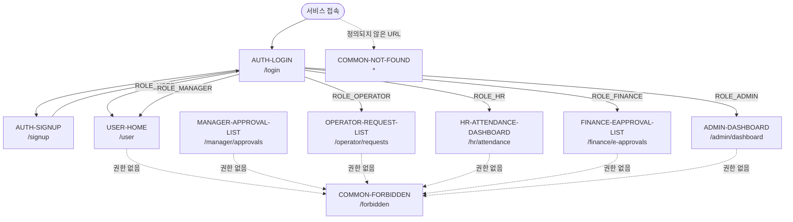

## 4. 인증 및 공통 흐름

### 4.1 인증 전 흐름

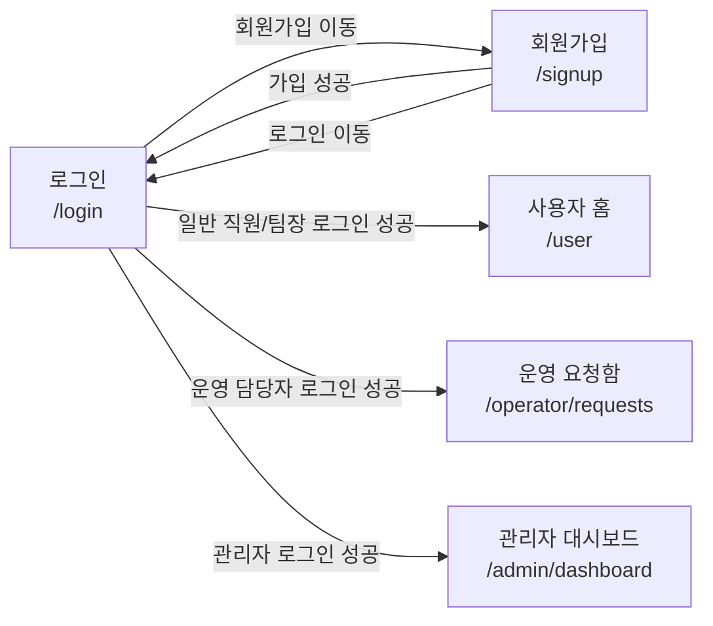

### 4.2 라우팅 보호 흐름

| 상황 | 이동 |
| --- | --- |
| 비로그인 사용자가 보호 화면 접근 | `/login` |
| 로그인 사용자가 `/login` 접근 | 권한별 기본 홈 |
| 권한 없는 사용자가 `/manager/*`, `/operator/*`, `/admin/*` 접근 | `/forbidden` |
| 정의되지 않은 URL 접근 | 404 화면 |

```mermaid
flowchart TD
    PROTECTED[보호된 URL 접근]
    IS_LOGIN{로그인 상태?}
    HAS_ROLE{접근 권한 있음?}
    LOGIN[/login]
    TARGET[요청한 화면]
    FORBIDDEN[/forbidden]
    NOT_FOUND[404 Not Found]

    PROTECTED --> IS_LOGIN
    IS_LOGIN -->|아니오| LOGIN
    IS_LOGIN -->|예| HAS_ROLE
    HAS_ROLE -->|예| TARGET
    HAS_ROLE -->|아니오| FORBIDDEN
    PROTECTED -.존재하지 않는 경로.-> NOT_FOUND
```

## 5. 사용자 화면 흐름

### 5.1 사용자 홈 중심 흐름

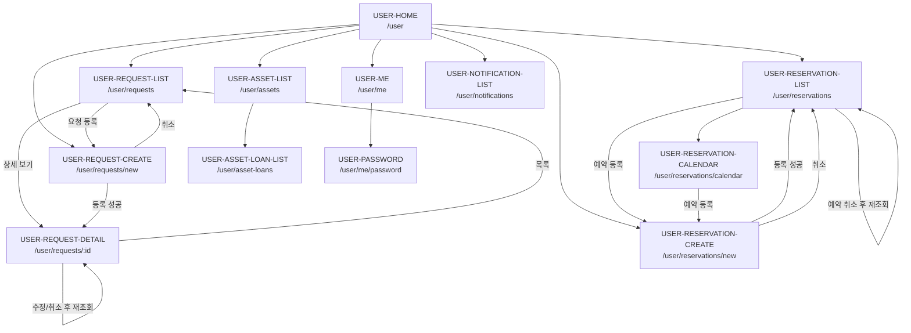

### 5.2 요청 등록 및 처리 결과 확인 흐름

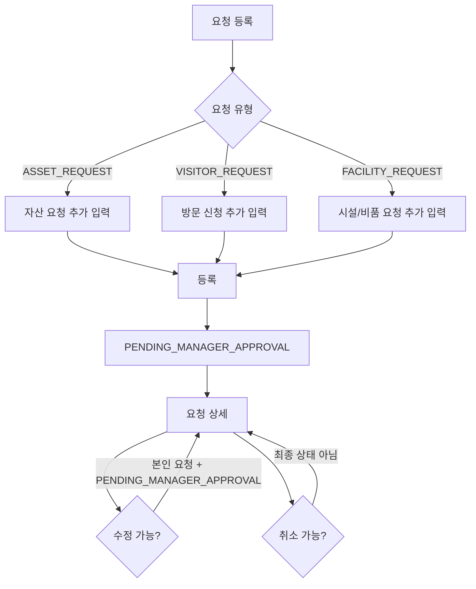

## 6. 핵심 요청 승인 흐름

이 흐름은 OfficeOps Hub의 MVP 핵심 업무 흐름이다.

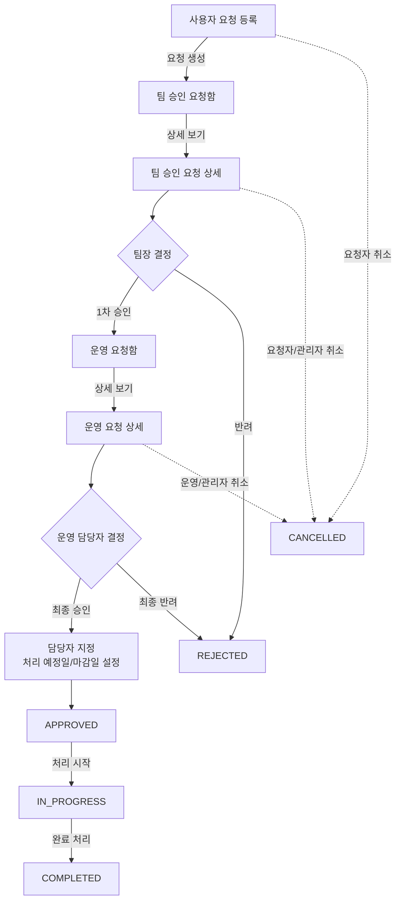

### 6.1 요청 상태별 화면 액션

| 상태 | 사용자 상세 | 팀장 상세 | 운영 상세 | 관리자 상세 |
| --- | --- | --- | --- | --- |
| PENDING_MANAGER_APPROVAL | 수정, 취소 | 1차 승인, 반려 | 조회 제한 | 조회/관리 |
| PENDING_OPERATOR_APPROVAL | 조회 | 조회 | 최종 승인, 최종 반려 | 최종 승인, 최종 반려 |
| APPROVED | 조회 | 조회 | 담당자 변경, 마감일 변경, 처리 중 | 담당자 변경, 마감일 변경, 처리 중 |
| IN_PROGRESS | 조회 | 조회 | 담당자 변경, 마감일 변경, 완료 | 담당자 변경, 마감일 변경, 완료 |
| COMPLETED | 조회 | 조회 | 조회 | 조회 |
| REJECTED | 조회 | 조회 | 조회 | 조회 |
| CANCELLED | 조회 | 조회 | 조회 | 조회 |

## 7. 팀장 화면 흐름

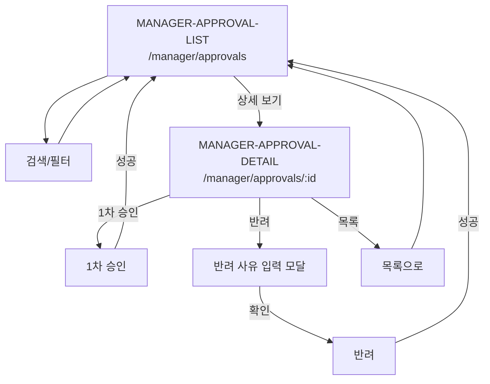

## 8. 운영 담당자 화면 흐름

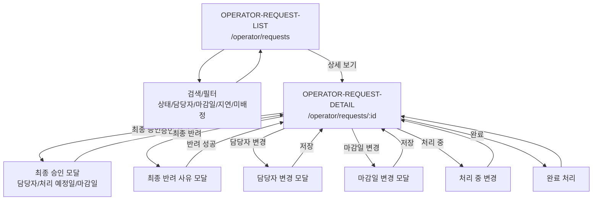

## 9. 예약 화면 흐름

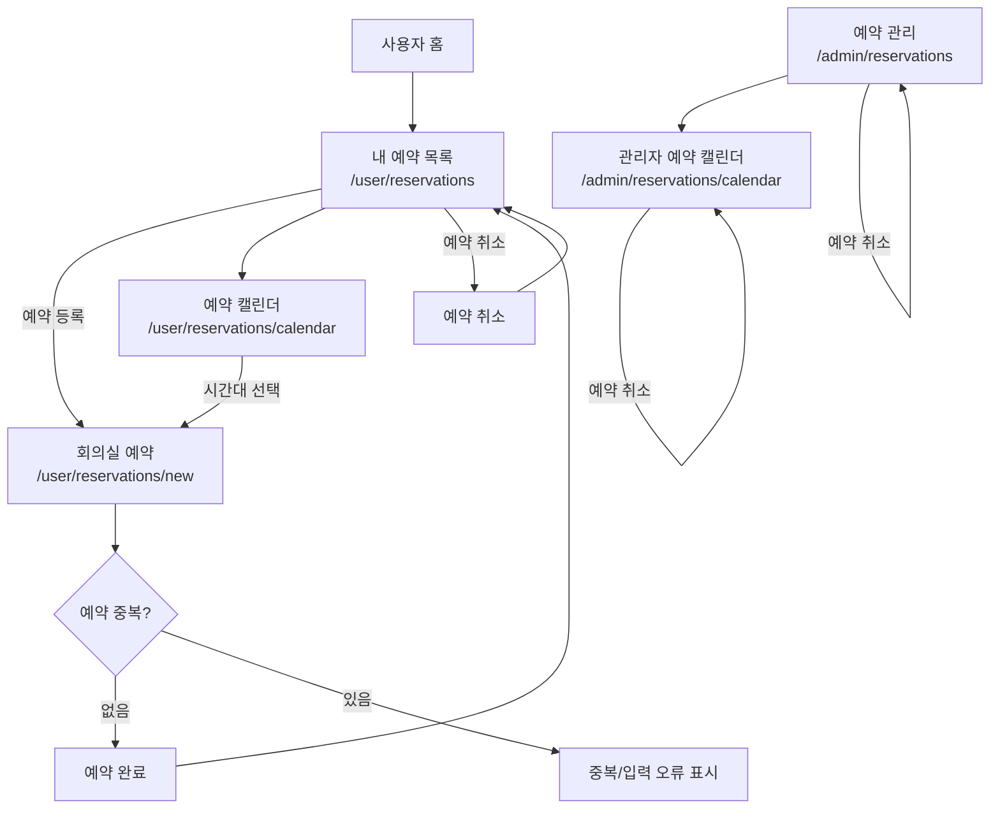

## 10. 자산 화면 흐름

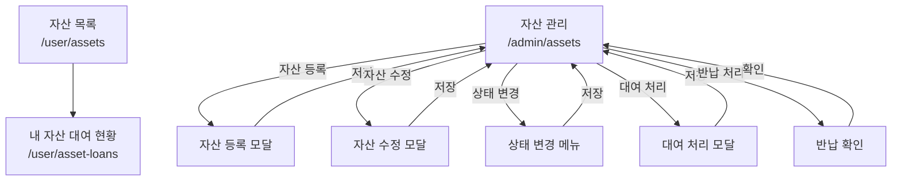

## 11. 관리자 화면 흐름

### 11.1 관리자 대시보드 중심 흐름

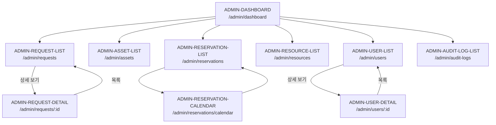

### 11.2 회의실/자원 관리 흐름

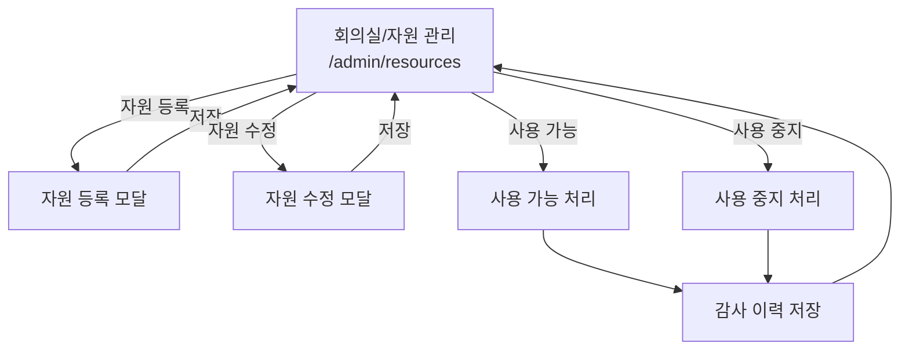

### 11.3 사용자 관리 흐름

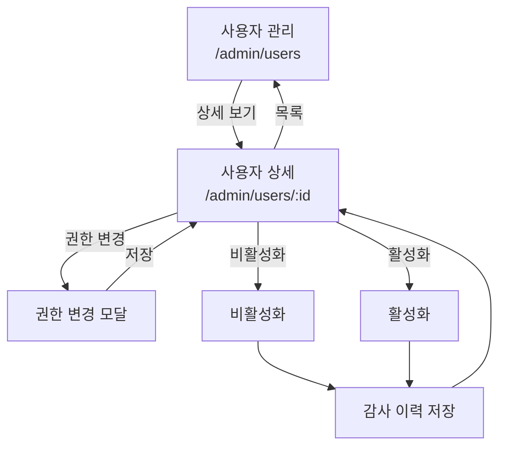

## 12. 근태/전자결재 화면 흐름

### 12.1 사용자 근태/전자결재 흐름

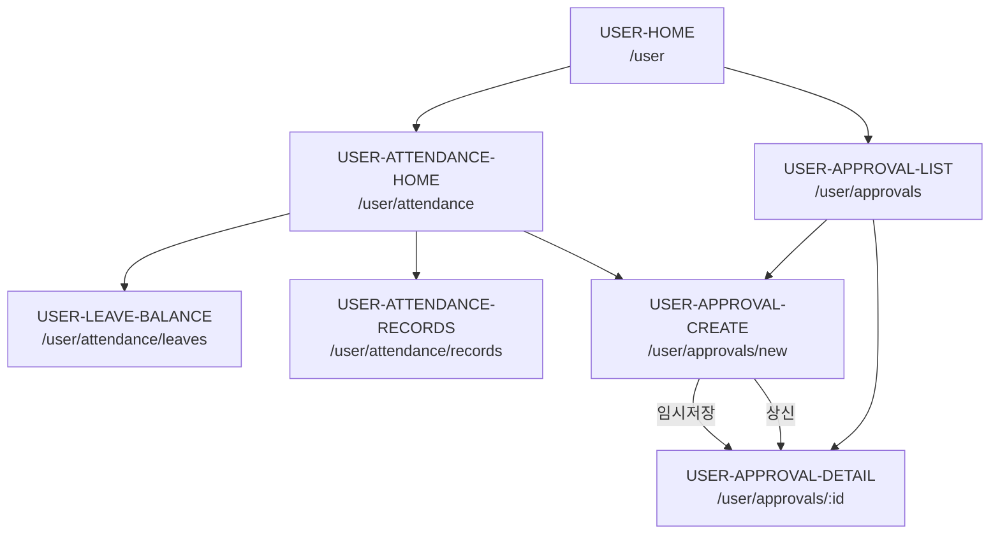

### 12.2 전자결재 승인 흐름

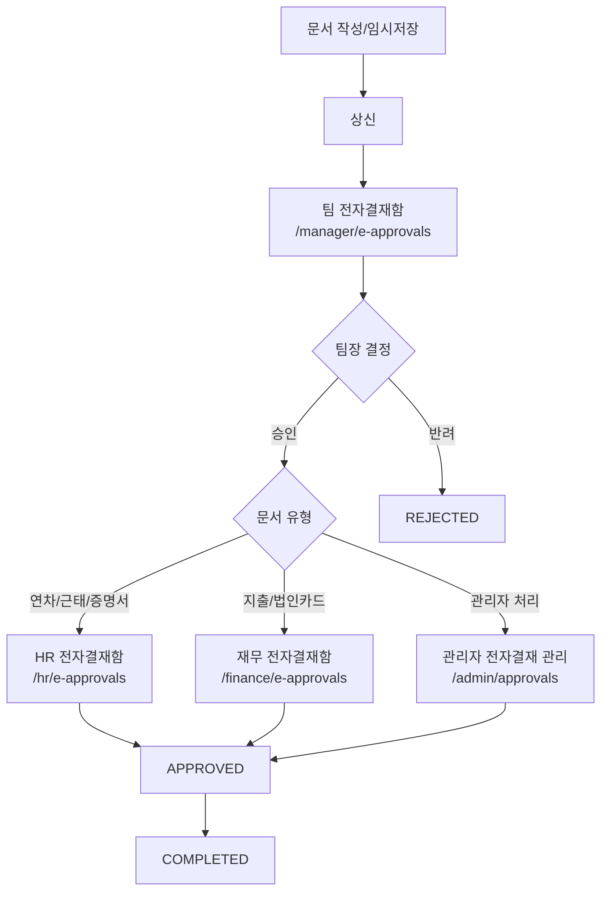

### 12.3 HR/Finance 운영 흐름

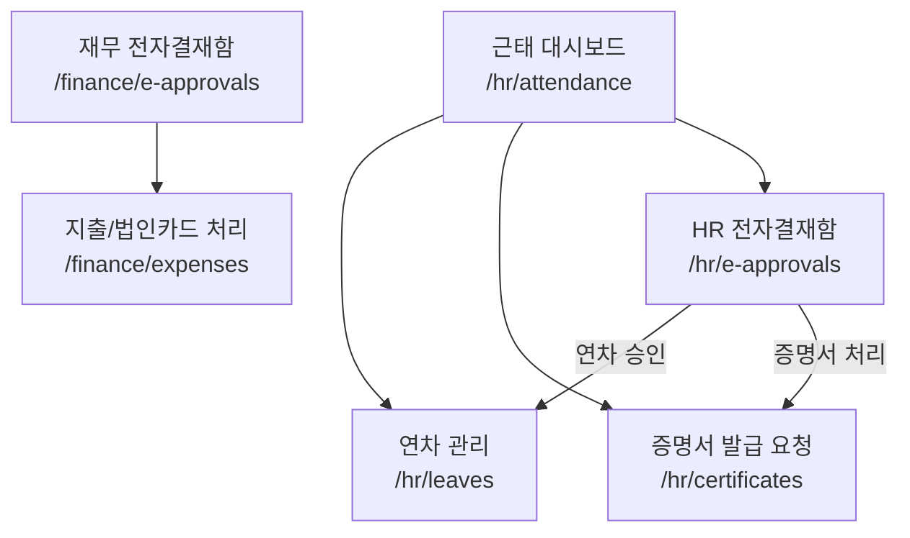

## 13. Fluid UI 화면 노드 목록

### 13.1 MVP 필수 화면

| 화면 ID | 화면명 | URL | 그룹 | 연결 대상 |
| --- | --- | --- | --- | --- |
| AUTH-LOGIN | 로그인 | `/login` | Auth | 회원가입, 권한별 홈 |
| AUTH-SIGNUP | 회원가입 | `/signup` | Auth | 로그인 |
| COMMON-FORBIDDEN | 권한 없음 | `/forbidden` | Common | 권한별 홈, 이전 화면 |
| COMMON-NOT-FOUND | 404 Not Found | `*` | Common | 권한별 홈, 로그인 |
| USER-HOME | 사용자 홈 | `/user` | User | 내 요청, 요청 등록, 내 예약, 예약 등록, 자산 목록, 내 근태, 전자결재, 내 정보 |
| USER-REQUEST-LIST | 내 요청 목록 | `/user/requests` | User | 요청 등록, 요청 상세 |
| USER-REQUEST-CREATE | 요청 등록 | `/user/requests/new` | User | 요청 상세, 내 요청 목록 |
| USER-REQUEST-DETAIL | 요청 상세 | `/user/requests/:id` | User | 내 요청 목록 |
| USER-RESERVATION-LIST | 내 예약 목록 | `/user/reservations` | User | 회의실 예약, 예약 캘린더 |
| USER-RESERVATION-CREATE | 회의실 예약 | `/user/reservations/new` | User | 내 예약 목록 |
| USER-ASSET-LIST | 자산 목록 | `/user/assets` | User | 내 자산 대여 현황 |
| USER-ME | 내 정보 | `/user/me` | User | 비밀번호 변경 |
| USER-ATTENDANCE-HOME | 내 근태 홈 | `/user/attendance` | User | 내 연차 현황, 출퇴근 기록, 전자결재 작성 |
| USER-LEAVE-BALANCE | 내 연차 현황 | `/user/attendance/leaves` | User | 전자결재 작성 |
| USER-ATTENDANCE-RECORDS | 내 출퇴근 기록 | `/user/attendance/records` | User | 내 근태 홈 |
| USER-APPROVAL-LIST | 내 전자결재 문서 | `/user/approvals` | User | 전자결재 작성, 전자결재 상세 |
| USER-APPROVAL-CREATE | 전자결재 작성 | `/user/approvals/new` | User | 전자결재 상세 |
| USER-APPROVAL-DETAIL | 전자결재 상세 | `/user/approvals/:id` | User | 내 전자결재 문서 |
| MANAGER-APPROVAL-LIST | 팀 승인 요청함 | `/manager/approvals` | Manager | 팀 승인 요청 상세 |
| MANAGER-APPROVAL-DETAIL | 팀 승인 요청 상세 | `/manager/approvals/:id` | Manager | 팀 승인 요청함 |
| MANAGER-EAPPROVAL-LIST | 팀 전자결재함 | `/manager/e-approvals` | Manager | 팀 전자결재 상세 |
| MANAGER-EAPPROVAL-DETAIL | 팀 전자결재 상세 | `/manager/e-approvals/:id` | Manager | HR/재무 전자결재함 |
| OPERATOR-REQUEST-LIST | 운영 요청함 | `/operator/requests` | Operator | 운영 요청 상세 |
| OPERATOR-REQUEST-DETAIL | 운영 요청 상세 | `/operator/requests/:id` | Operator | 운영 요청함 |
| HR-ATTENDANCE-DASHBOARD | 근태 대시보드 | `/hr/attendance` | HR | 연차 관리, 증명서, HR 전자결재함 |
| HR-LEAVE-MANAGEMENT | 연차 관리 | `/hr/leaves` | HR | 근태 대시보드 |
| HR-CERTIFICATE-LIST | 증명서 발급 요청 | `/hr/certificates` | HR | HR 전자결재함 |
| HR-EAPPROVAL-LIST | HR 전자결재함 | `/hr/e-approvals` | HR | 연차 관리, 증명서 |
| FINANCE-EAPPROVAL-LIST | 재무 전자결재함 | `/finance/e-approvals` | Finance | 지출/법인카드 처리 |
| FINANCE-EXPENSE-LIST | 지출/법인카드 처리 | `/finance/expenses` | Finance | 재무 전자결재함 |
| ADMIN-DASHBOARD | 관리자 대시보드 | `/admin/dashboard` | Admin | 관리자 주요 목록 |
| ADMIN-REQUEST-LIST | 전체 요청 관리 | `/admin/requests` | Admin | 요청 상세 관리 |
| ADMIN-REQUEST-DETAIL | 요청 상세 관리 | `/admin/requests/:id` | Admin | 전체 요청 관리 |
| ADMIN-ASSET-LIST | 자산 관리 | `/admin/assets` | Admin | 등록/수정/상태/대여/반납 모달 |
| ADMIN-RESERVATION-LIST | 예약 관리 | `/admin/reservations` | Admin | 관리자 예약 캘린더 |
| ADMIN-RESOURCE-LIST | 회의실/자원 관리 | `/admin/resources` | Admin | 등록/수정/상태 변경 모달 |
| ADMIN-APPROVAL-LIST | 전체 전자결재 관리 | `/admin/approvals` | Admin | 전자결재 양식 관리 |
| ADMIN-APPROVAL-FORM-LIST | 전자결재 양식 관리 | `/admin/approval-forms` | Admin | 전체 전자결재 관리 |
| ADMIN-ATTENDANCE-POLICY | 근태 정책 관리 | `/admin/attendance-policies` | Admin | 대시보드 |
| ADMIN-AUDIT-LOG-LIST | 감사 이력 | `/admin/audit-logs` | Admin | 대시보드 |

### 13.2 2순위 및 MVP 이후 화면

| 화면 ID | 화면명 | URL | 우선순위 |
| --- | --- | --- | --- |
| USER-RESERVATION-CALENDAR | 예약 캘린더 | `/user/reservations/calendar` | 권장 |
| USER-ASSET-LOAN-LIST | 내 자산 대여 현황 | `/user/asset-loans` | 권장 |
| USER-NOTIFICATION-LIST | 알림 목록 | `/user/notifications` | 2순위 |
| USER-PASSWORD | 비밀번호 변경 | `/user/me/password` | MVP 이후 |
| ADMIN-RESERVATION-CALENDAR | 관리자 예약 캘린더 | `/admin/reservations/calendar` | 권장 |
| ADMIN-USER-LIST | 사용자 관리 | `/admin/users` | 선택 |
| ADMIN-USER-DETAIL | 사용자 상세/권한 변경 | `/admin/users/:id` | 권장 |

## 14. Fluid UI 제작 순서 제안

1. `AUTH-LOGIN`, `AUTH-SIGNUP`, `COMMON-FORBIDDEN`, `COMMON-NOT-FOUND`를 먼저 배치한다.
2. 중앙에 `USER-HOME`을 놓고 사용자 업무 화면을 좌측 또는 하단으로 연결한다.
3. `MANAGER-APPROVAL-LIST`와 `OPERATOR-REQUEST-LIST`를 요청 승인 흐름의 오른쪽에 배치한다.
4. `ADMIN-DASHBOARD`를 별도 관리자 영역의 시작점으로 두고 관리 화면을 연결한다.
5. 요청 승인 흐름은 굵은 선으로 강조한다.
6. 예약, 자산, 사용자 관리, 감사 이력은 관리자 대시보드에서 분기되는 보조 흐름으로 구성한다.
7. 모달은 별도 화면 카드로 만들되, 실제 라우팅 화면과 다른 색상 또는 작은 카드로 표현한다.

## 15. MVP 구현 우선순위 기준 화면 흐름

MVP 화면흐름도만 먼저 그릴 경우 다음 흐름을 우선 구성한다.

```text
로그인
-> 권한별 홈
-> 요청 등록
-> 내 요청 상세
-> 팀 승인 요청함
-> 팀 승인 상세
-> 운영 요청함
-> 운영 요청 상세
-> 관리자 요청 관리
-> 관리자 대시보드
```

예약과 자산은 다음 순서로 추가한다.

```text
사용자 홈
-> 회의실 예약
-> 내 예약 목록
-> 관리자 예약 관리
-> 자산 목록
-> 관리자 자산 관리
```

관리자 보조 흐름은 마지막에 추가한다.

```text
관리자 대시보드
-> 회의실/자원 관리
-> 사용자 관리
-> 감사 이력
```
