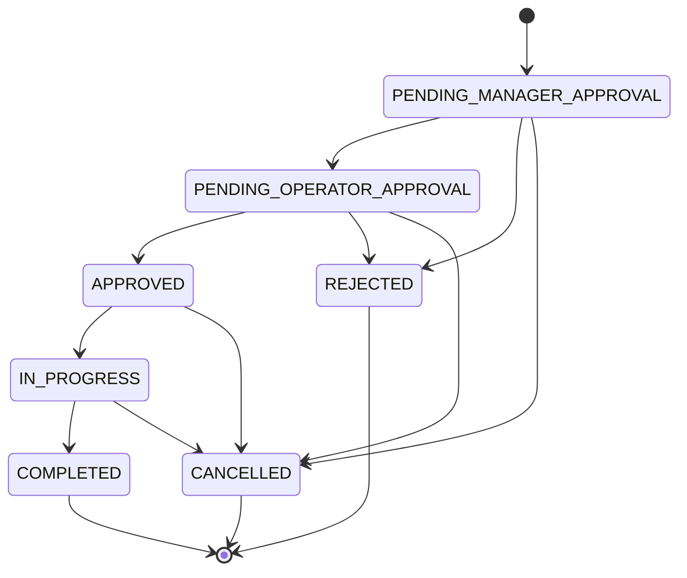

# OfficeOps Hub 상태/권한 정책 문서

## 문서 버전 이력

| 버전 | 기준 | 수정 사항 | 삭제 사항 |
| --- | --- | --- | --- |
| v1.0.0 | 관리자 전용 계정 생성 반영 이전 권한 정책 | 기존 역할별 접근 정책과 `/login`, `/signup` 비로그인 접근 기준선 | 없음 |
| v1.1.0 | 관리자 전용 계정 생성 반영 | API 권한 정책에 `사용자 계정 생성`을 `ROLE_ADMIN` 전용으로 추가, 비로그인 접근 경로를 `/login` 중심으로 정리 | `/signup` 비로그인 접근 정책 제거 |
| v1.2.0 | 문서 네이밍 및 버전 관리 체계 정리 | 문서 파일명을 번호 없는 한글 제목 기반 규칙으로 정리하고 버전 표기를 semantic version 형식으로 통일 | 문서 번호 접두어와 영문 기반 산출물 파일명 제거 |
| v1.3.0 | 파일명 버전 최신화 규칙 반영 | 문서 파일명의 버전을 문서 내부 최신 버전과 동일하게 관리하도록 정리하고, 이후 수정 및 버전 상승 시 파일명과 참조 링크를 즉시 갱신하는 규칙 추가 | 최신 버전과 맞지 않는 파일명 버전 표기 제거 |

## 1. 문서 목적

이 문서는 `OfficeOps Hub`의 상태 전이, 권한별 접근 범위, 데이터 접근 규칙, 화면 보호 정책을 정의한다.

프론트엔드 라우팅, 백엔드 Spring Security, 서비스 계층 권한 검증, 테스트 작성의 기준으로 사용한다.

## 2. 역할 정의

| 역할 | 코드 | 설명 |
| --- | --- | --- |
| 일반 직원 | ROLE_USER | 요청 등록자, 예약자 |
| 팀장 | ROLE_MANAGER | 소속 팀원의 요청 1차 승인자 |
| 운영 담당자 | ROLE_OPERATOR | 요청 최종 승인자, 자산/예약 운영 담당자 |
| HR 담당자 | ROLE_HR | 연차/근태 정책, 근태 현황, 증명서 처리 담당자 |
| 재무 담당자 | ROLE_FINANCE | 지출결의서, 법인카드 사용내역서 처리 담당자 |
| 관리자 | ROLE_ADMIN | 전체 운영 총괄 |

## 3. 사용자 상태 정책

| 상태 | 설명 | 로그인 가능 |
| --- | --- | --- |
| ACTIVE | 활성 사용자 | 가능 |
| INACTIVE | 비활성 사용자 | 불가 |

정책:

- 사용자를 삭제하지 않고 `INACTIVE` 상태로 변경한다.
- 비활성 사용자의 기존 요청, 예약, 대여, 이력은 유지한다.
- 비활성 사용자는 로그인할 수 없다.
- 사용자 상태 변경은 감사 이력에 저장한다.

## 4. 요청 상태 정책

### 4.1 상태 정의

| 상태 | 설명 |
| --- | --- |
| PENDING_MANAGER_APPROVAL | 팀장 승인 대기 |
| PENDING_OPERATOR_APPROVAL | 운영 담당자 최종 승인 대기 |
| APPROVED | 최종 승인 |
| REJECTED | 반려 |
| IN_PROGRESS | 처리 중 |
| COMPLETED | 완료 |
| CANCELLED | 취소 |

### 4.2 상태 전이



### 4.3 전이 권한

| 현재 상태 | 변경 상태 | 가능 주체 |
| --- | --- | --- |
| PENDING_MANAGER_APPROVAL | PENDING_OPERATOR_APPROVAL | 소속 팀장, 관리자 |
| PENDING_MANAGER_APPROVAL | REJECTED | 소속 팀장, 관리자 |
| PENDING_MANAGER_APPROVAL | CANCELLED | 요청자, 관리자 |
| PENDING_OPERATOR_APPROVAL | APPROVED | 운영 담당자, 관리자 |
| PENDING_OPERATOR_APPROVAL | REJECTED | 운영 담당자, 관리자 |
| PENDING_OPERATOR_APPROVAL | CANCELLED | 관리자 |
| APPROVED | IN_PROGRESS | 운영 담당자, 요청 담당자, 관리자 |
| APPROVED | CANCELLED | 운영 담당자, 관리자 |
| IN_PROGRESS | COMPLETED | 운영 담당자, 요청 담당자, 관리자 |
| IN_PROGRESS | CANCELLED | 운영 담당자, 관리자 |

금지 규칙:

- `COMPLETED`, `REJECTED`, `CANCELLED`는 최종 상태다.
- 최종 상태 요청은 수정할 수 없다.
- 요청자는 승인/반려/처리 중/완료 상태로 직접 변경할 수 없다.
- 요청자는 `PENDING_MANAGER_APPROVAL` 상태에서만 수정할 수 있다.

## 5. 승인 정책

| 단계 | 상태 | 승인자 | 결과 |
| --- | --- | --- | --- |
| 1차 | PENDING_MANAGER_APPROVAL | 팀장 | PENDING_OPERATOR_APPROVAL 또는 REJECTED |
| 최종 | PENDING_OPERATOR_APPROVAL | 운영 담당자 | APPROVED 또는 REJECTED |

정책:

- 팀장은 소속 팀원의 요청만 승인할 수 있다.
- 운영 담당자는 팀장 승인 완료 요청만 최종 승인할 수 있다.
- 최종 승인 시 담당자, 처리 예정일, 마감일을 지정할 수 있다.
- 모든 승인/반려는 `request_approvals`에 저장한다.
- 상태 변경은 `request_histories`에 저장한다.
- 담당자 지정과 마감일 변경은 `audit_logs`에 저장한다.

## 6. 예약 상태 정책

| 상태 | 설명 |
| --- | --- |
| RESERVED | 예약 완료 |
| CANCELLED | 예약 취소 |
| COMPLETED | 사용 완료 |

전이:

| 현재 상태 | 변경 상태 | 가능 주체 |
| --- | --- | --- |
| RESERVED | CANCELLED | 예약자, 운영 담당자, 관리자 |
| RESERVED | COMPLETED | 시스템, 운영 담당자, 관리자 |

중복 방지:

```text
새 예약 시작 시간 < 기존 예약 종료 시간
AND
새 예약 종료 시간 > 기존 예약 시작 시간
AND
기존 예약 상태 = RESERVED
```

정책:

- 일반 회의실 예약은 중복이 없으면 자동 승인한다.
- 사용 중지 자원은 신규 예약 대상에서 제외한다.
- 예약 시작 전까지만 사용자가 직접 취소할 수 있다.
- 예약 취소 시 `cancelled_by`, `cancelled_at`, `cancel_reason`을 저장한다.
- 예약 상태 변경과 취소는 `reservation_histories`에 저장한다.
- 특수 자원 승인 예약은 MVP 이후 확장한다.

## 7. 자산 상태 정책

| 상태 | 설명 |
| --- | --- |
| AVAILABLE | 사용 가능 |
| RESERVED | 예약됨 |
| IN_USE | 사용 중 |
| MAINTENANCE | 점검 중 |
| RETIRED | 폐기 |

전이:

| 현재 상태 | 변경 가능 상태 |
| --- | --- |
| AVAILABLE | RESERVED, IN_USE, MAINTENANCE, RETIRED |
| RESERVED | IN_USE, AVAILABLE |
| IN_USE | AVAILABLE, MAINTENANCE |
| MAINTENANCE | AVAILABLE, RETIRED |
| RETIRED | 없음 |

정책:

- `MAINTENANCE`, `RETIRED` 상태 자산은 대여할 수 없다.
- 대여 시 `IN_USE`로 변경한다.
- 반납 시 `AVAILABLE`로 변경한다.
- 요청 승인 결과로 자산을 대여하는 경우 `asset_loans.request_id`로 요청과 대여 이력을 연결한다.
- 대여/반납 처리자는 `processed_by`로 저장한다.
- 자산 상태 변경 이력은 2순위 기능으로 저장한다.

## 8. 자원 상태 정책

| 상태 | 설명 |
| --- | --- |
| AVAILABLE | 예약 가능 |
| DISABLED | 예약 불가 |

정책:

- `DISABLED` 상태 자원은 신규 예약 대상에서 제외한다.
- 사용 중지 전에 기존 예약을 자동 취소하지 않는다.
- 관리자가 필요한 예약을 별도로 취소한다.
- 자원 상태 변경은 감사 이력에 저장한다.

## 9. API 권한 정책

| 기능 | ROLE_USER | ROLE_MANAGER | ROLE_OPERATOR | ROLE_ADMIN |
| --- | --- | --- | --- | --- |
| 내 요청 등록 | 가능 | 가능 | 가능 | 가능 |
| 내 요청 조회 | 가능 | 가능 | 가능 | 가능 |
| 내 요청 수정/취소 | 본인 요청 | 본인 요청 | 본인 요청 | 전체 |
| 팀 승인 요청함 | 불가 | 소속 팀 | 불가 | 가능 |
| 팀장 승인/반려 | 불가 | 소속 팀 | 불가 | 가능 |
| 운영 요청함 | 불가 | 불가 | 가능 | 가능 |
| 최종 승인/반려 | 불가 | 불가 | 가능 | 가능 |
| 담당자 지정/변경 | 불가 | 불가 | 가능 | 가능 |
| 처리 중/완료 | 불가 | 불가 | 담당 요청 | 가능 |
| 예약 등록 | 가능 | 가능 | 가능 | 가능 |
| 전체 예약 관리 | 불가 | 불가 | 가능 | 가능 |
| 자산 조회 | 가능 | 가능 | 가능 | 가능 |
| 자산 등록/수정 | 불가 | 불가 | 가능 | 가능 |
| 자원 관리 | 불가 | 불가 | 불가 | 가능 |
| 사용자 계정 생성 | 불가 | 불가 | 불가 | 가능 |
| 사용자 관리 | 불가 | 불가 | 불가 | 가능 |
| 감사 이력 조회 | 불가 | 불가 | 불가 | 가능 |

## 9.1 HR/전자결재 권한 정책

| 기능 | ROLE_USER | ROLE_MANAGER | ROLE_OPERATOR | ROLE_HR | ROLE_FINANCE | ROLE_ADMIN |
| --- | --- | --- | --- | --- | --- | --- |
| 내 근태/연차 조회 | 본인 | 본인 | 본인 | 본인 | 본인 | 가능 |
| 출근/퇴근 기록 | 본인 | 본인 | 본인 | 본인 | 본인 | 가능 |
| 팀 근태 현황 | 불가 | 소속 팀 | 불가 | 전체 | 불가 | 전체 |
| 연차 조정 | 불가 | 불가 | 불가 | 가능 | 불가 | 가능 |
| 전자결재 작성 | 가능 | 가능 | 가능 | 가능 | 가능 | 가능 |
| 내 전자결재 조회 | 본인/참조 | 본인/참조 | 본인/참조 | 본인/참조 | 본인/참조 | 전체 |
| 팀 전자결재 승인 | 불가 | 소속 팀 | 불가 | 불가 | 불가 | 가능 |
| HR 전자결재 처리 | 불가 | 불가 | 불가 | 가능 | 불가 | 가능 |
| 재무 전자결재 처리 | 불가 | 불가 | 불가 | 불가 | 가능 | 가능 |
| 증명서 발급 처리 | 불가 | 불가 | 불가 | 가능 | 불가 | 가능 |
| 전자결재 양식 관리 | 불가 | 불가 | 불가 | 불가 | 불가 | 가능 |
| 근태 정책 관리 | 불가 | 불가 | 불가 | 가능 | 불가 | 가능 |

## 9.2 전자결재 상태 정책

| 상태 | 설명 |
| --- | --- |
| DRAFT | 임시저장 |
| SUBMITTED | 상신 완료 |
| PENDING_MANAGER_APPROVAL | 팀장 승인 대기 |
| PENDING_FINAL_APPROVAL | HR/재무/관리자 최종 확인 대기 |
| APPROVED | 최종 승인 |
| REJECTED | 반려 |
| COMPLETED | 후속 처리 완료 |
| CANCEL_REQUESTED | 취소 요청 |
| CANCELLED | 취소 완료 |

상태 전이:

| 현재 상태 | 변경 상태 | 가능 주체 |
| --- | --- | --- |
| DRAFT | SUBMITTED | 작성자 |
| SUBMITTED | PENDING_MANAGER_APPROVAL | 시스템 |
| PENDING_MANAGER_APPROVAL | PENDING_FINAL_APPROVAL | 팀장, 관리자 |
| PENDING_MANAGER_APPROVAL | REJECTED | 팀장, 관리자 |
| PENDING_FINAL_APPROVAL | APPROVED | HR/재무/관리자 담당자 |
| PENDING_FINAL_APPROVAL | REJECTED | HR/재무/관리자 담당자 |
| APPROVED | COMPLETED | HR/재무/관리자 담당자, 시스템 |
| APPROVED | CANCEL_REQUESTED | 작성자 |
| CANCEL_REQUESTED | CANCELLED | HR/재무/관리자 담당자 |

정책:

- 작성자는 `DRAFT` 상태 문서만 수정할 수 있다.
- 상신 이후 본문 수정은 불가하며, 필요 시 취소 후 재작성한다.
- 반려 시 반려 사유는 필수다.
- 문서 유형이 HR 도메인이면 최종 단계는 `ROLE_HR`, 비용 도메인이면 `ROLE_FINANCE`로 생성한다.
- 연차 신청 최종 승인 시 연차 잔여일수를 차감한다.
- 연차 취소 신청 최종 승인 시 원본 연차 사용 이력을 취소하고 잔여일수를 복원한다.
- 결재 단계와 상태 변경은 `approval_histories`에 저장한다.

## 9.3 근태 상태 정책

| 상태 | 설명 |
| --- | --- |
| NOT_CHECKED_IN | 출근 전 |
| CHECKED_IN | 출근 상태 |
| ON_BREAK | 휴게 중 |
| CHECKED_OUT | 퇴근 완료 |
| CORRECTED | HR 또는 관리자 보정 |

정책:

- 사용자는 하루에 하나의 근태 기록을 가진다.
- `CHECKED_OUT` 이후 사용자는 직접 수정할 수 없으며, HR 담당자 또는 관리자가 보정한다.
- 팀장은 소속 팀원의 근태 현황만 조회한다.
- HR 담당자와 관리자는 전체 부서 또는 특정 부서 근태 현황을 조회한다.

## 10. 화면 접근 정책

| 경로 | 접근 권한 |
| --- | --- |
| `/login` | 비로그인 |
| `/user/*` | 로그인 사용자 |
| `/manager/*` | ROLE_MANAGER, ROLE_ADMIN |
| `/operator/*` | ROLE_OPERATOR, ROLE_ADMIN |
| `/hr/*` | ROLE_HR, ROLE_ADMIN |
| `/finance/*` | ROLE_FINANCE, ROLE_ADMIN |
| `/admin/dashboard` | ROLE_ADMIN |
| `/admin/requests/*` | ROLE_OPERATOR, ROLE_ADMIN |
| `/admin/assets/*` | ROLE_OPERATOR, ROLE_ADMIN |
| `/admin/reservations/*` | ROLE_OPERATOR, ROLE_ADMIN |
| `/admin/resources/*` | ROLE_ADMIN |
| `/admin/users/*` | ROLE_ADMIN |
| `/admin/approvals/*` | ROLE_ADMIN |
| `/admin/approval-forms/*` | ROLE_ADMIN |
| `/admin/attendance-policies/*` | ROLE_ADMIN |
| `/admin/audit-logs` | ROLE_ADMIN |

## 11. 데이터 접근 정책

- 요청자는 본인 요청만 조회/수정/취소할 수 있다.
- 팀장은 `manager_id` 기준으로 소속 팀원의 요청만 승인할 수 있다.
- 운영 담당자는 운영 요청함과 본인 담당 요청을 처리할 수 있다.
- 관리자는 전체 데이터를 조회하고 관리할 수 있다.
- 프론트엔드에서 버튼을 숨겨도 백엔드에서 반드시 권한을 재검증한다.

## 12. 감사 이력 정책

필수 감사 대상:

- 팀장 승인/반려
- 운영 담당자 최종 승인/반려
- 전자결재 승인/반려/완료/취소
- HR 연차 조정
- HR 증명서 발급 완료 처리
- 재무 지출결의서/법인카드 사용내역 처리
- 출퇴근 기록 보정
- 담당자 지정/변경
- 처리 예정일/마감일 변경
- 사용자 비활성화/활성화
- 자원 사용 가능/사용 중지 변경

2순위 감사 대상:

- 자산 상태 변경
- 사용자 권한 변경

저장 원칙:

- 작업자, 작업 유형, 대상 리소스, 변경 전 값, 변경 후 값, 작업 시각을 저장한다.
- 변경 전/후 값은 JSON 구조로 저장한다.
- 가능한 경우 요청 IP와 User-Agent를 함께 저장한다.
- 민감 정보인 비밀번호는 감사 이력에 저장하지 않는다.

## 13. 알림 연결 정책

- 알림은 관련 리소스로 이동할 수 있도록 `target_type`, `target_id`를 저장한다.
- 요청 관련 알림은 `target_type = REQUEST`를 사용한다.
- 예약 관련 알림은 `target_type = RESERVATION`을 사용한다.
- 자산 관련 알림은 `target_type = ASSET` 또는 `ASSET_LOAN`을 사용한다.
- 전자결재 관련 알림은 `target_type = APPROVAL_DOCUMENT`를 사용한다.
- 출퇴근 보정처럼 전자결재 문서가 없는 근태 알림은 `target_type = ATTENDANCE_RECORD`를 사용한다.

## 14. 공통 코드 정책

- 공통 코드는 `code_groups`, `code_items`로 관리할 수 있다.
- MVP에서는 seed 데이터로 생성하고, 관리자 수정 화면은 MVP 이후로 미룬다.
- 프론트엔드는 공통 코드 조회 API로 select 옵션을 구성할 수 있다.
- 백엔드는 enum 또는 공통 코드 기준으로 요청값을 검증한다.
