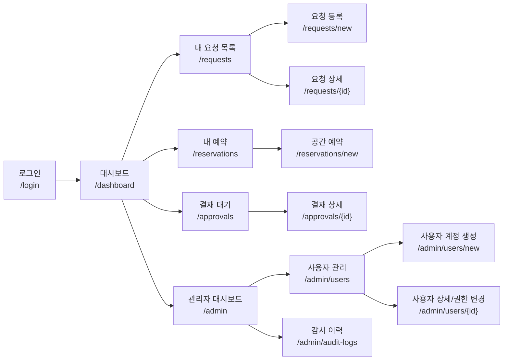

# OfficeOps Hub 화면 흐름도

## 문서 버전 이력

| 버전 | 구분 | 수정 사항 | 삭제 사항 |
| --- | --- | --- | --- |
| v1.0.0 | 관리자 전용 계정 생성 반영 이전 화면 흐름 기준선 | 기존 화면 흐름도 기준선 | 없음 |
| v1.1.0 | 관리자 전용 계정 생성 반영 | `/admin/users/new` 사용자 계정 생성 화면과 관리자 사용자 관리 흐름 추가 | `/signup` 공개 회원가입 화면과 로그인-회원가입 연결 제거 |
| v1.2.0 | 문서 네이밍 및 버전 관리 체계 정리 | 문서 파일명을 번호 없는 한글 제목 기반 규칙으로 정리하고 버전 표기를 semantic version 형식으로 통일 | 문서 번호 접두어와 영문 기반 산출물 파일명 제거 |
| v1.3.0 | 파일명 버전 최신화 규칙 반영 | 문서 파일명의 버전을 문서 내부 최신 버전과 동일하게 관리하도록 정리하고, 이후 수정 및 버전 상승 시 파일명과 참조 링크를 즉시 갱신하는 규칙 추가 | 최신 버전과 맞지 않는 파일명 버전 표기 제거 |

## 1. 문서 목적

이 문서는 `OfficeOps Hub`의 1차 구현 범위에서 필요한 주요 화면과 화면 간 이동 흐름을 정리한다.

화면 흐름은 일반 사용자, 결재/처리 담당자, 시스템 관리자가 동일한 내부 운영 시스템 안에서 어떤 화면을 거쳐 업무를 처리하는지 확인하기 위한 기준으로 사용한다.

## 2. 주요 사용자 흐름

| 사용자 | 시작 화면 | 주요 이동 흐름 |
| --- | --- | --- |
| 일반 사용자 | 로그인 | 대시보드 -> 요청 목록/등록 -> 요청 상세 -> 내 예약/예약 등록 -> 내 정보 |
| 결재자 | 로그인 | 대시보드 -> 결재 대기 목록 -> 결재 상세 -> 승인/반려 |
| 운영 관리자 | 로그인 | 대시보드 -> 요청 관리 -> 요청 상세 -> 담당자/상태 변경 -> 자산/예약 관리 |
| HR 관리자 | 로그인 | 대시보드 -> HR 요청 관리 -> 휴가/근태/증명서 요청 상세 -> 승인/반려/처리 |
| 재무 관리자 | 로그인 | 대시보드 -> 재무 요청 관리 -> 지출/법인카드 상세 -> 승인/반려/처리 |
| 시스템 관리자 | 로그인 | 관리자 대시보드 -> 사용자 관리 -> 사용자 계정 생성/권한 변경 -> 감사 이력 |

## 3. 화면 흐름 요약

## 4. 화면별 기준

| 화면 | URL | 접근 권한 | 핵심 기능 |
| --- | --- | --- | --- |
| 로그인 | `/login` | 비로그인 | 이메일/비밀번호 로그인, JWT 발급 |
| 대시보드 | `/dashboard` | 전체 로그인 사용자 | 내 요청, 내 예약, 결재/처리 대기 현황 요약 |
| 내 요청 목록 | `/requests` | 전체 로그인 사용자 | 요청 검색, 상태 필터, 요청 상세 이동 |
| 요청 등록 | `/requests/new` | 일반 사용자 이상 | 지원/비품/HR 기본 기능 요청 등록 |
| 요청 상세 | `/requests/{id}` | 요청자, 결재자, 담당자, 관리자 | 요청 상태 확인, 취소, 승인/반려/처리 |
| 내 예약 | `/reservations` | 전체 로그인 사용자 | 회의실/라운지 등 공간 예약 목록 |
| 공간 예약 | `/reservations/new` | 전체 로그인 사용자 | 예약 가능 시간 조회, 예약 신청 |
| 결재 대기 | `/approvals` | 결재 권한 사용자 | 승인 대기 요청 조회 |
| 결재 상세 | `/approvals/{id}` | 결재 권한 사용자 | 시스템 내 승인/반려 처리, 일정 확인 |
| 관리자 대시보드 | `/admin` | 시스템 관리자 | 전체 운영 현황 요약 |
| 사용자 관리 | `/admin/users` | 시스템 관리자 | 사용자 목록, 권한 필터, 사용자 상세 이동 |
| 사용자 계정 생성 | `/admin/users/new` | 시스템 관리자 | 일반 사용자와 담당자 계정 생성 |
| 사용자 상세/권한 변경 | `/admin/users/{id}` | 시스템 관리자 | 사용자 상태 변경, 역할 부여/회수 |
| 감사 이력 | `/admin/audit-logs` | 시스템 관리자 | 관리자 작업 이력 조회 |

## 5. 프로토타입 기준

시각화 프로토타입은 `docs/prototypes/OfficeOps_hub_현재화면흐름도프로토타입_v1.3.0.html`을 기준으로 한다.
